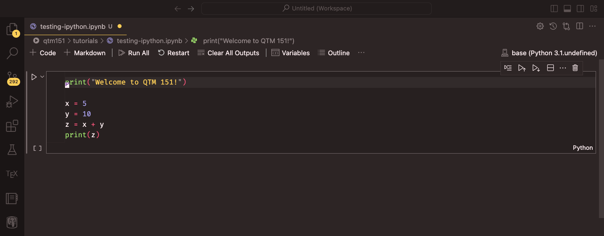

## About Me {background="#43464B"}

:::: {layout="[1.5,1]"}
::: {#first-column}
### Damien Dupré, PhD

- email: damien.dupre@dcu.ie
- phone: 00353 (0)1 700 6360
- office: Q233 DCU Business School
:::

::: {#second-column}
Since 2019, I have been teaching **Data Analytics** and **Statistics** at DCU Business School.

{style="border-radius:50%;"}
:::
::::

## Module Content

:::: {layout="[1,1]"}
::: {#first-column}
### Knowledge

- How code is written and read
- How data is stored and transformed
- How a prediction is made

### Skills

- Python
- Google Colab, VS Code
- pandas, matplotlib, seaborn
- statsmodels, scikit-learn
:::

::: {#second-column}
### Content

- 2hrs per week of lectures
- 1hr per week of tutorials (from week 3)

### Slides

Available on the module's loop page and, more importantly, online at:

[https://damien-dupre.github.io -> courses -> BAA1118](https://damien-dupre.github.io/courses/details/BAA1118)
:::
::::

## Module Roadmap

| Week | Topic |
|:-----|:------|
| 2 | Variables, types and operators |
| 3 | Collections: lists, dictionaries and friends |
| 4 | Control flow: conditions and loops |
| 5 | Functions, modules and packages |
| 6 | From Colab to your own machine |
| 7 | Data manipulation with pandas |
| 8 | Aggregating, joining and reshaping |
| 9 | Data visualisation |
| 10 | Linear regression and prediction |

## What About You?

- Who is convinced they are "not a maths person"?
- Who uses Microsoft Windows, macOS, or Linux?
- Who already has a GitHub account?
- Who has already written a line of code in any language?
- Who has used ChatGPT, Claude, or Copilot to write code?

**No previous experience is assumed. We start from zero.**

## Module Assessment

### 90% Inclass Test

- 1h Inclass Test on October 29
- 1h Inclass Test on November 26

### 10% Kubicle Courses

- [Python Fundamentals](https://app.kubicle.com/courses/python-fundamentals?learning_path_id=42&u=true)
- [Functions, Conditionality and Loops](https://app.kubicle.com/courses/functions-conditionality-and-loops?learning_path_id=42&u=true)
- [Storing, Transforming and Visualizing Data](https://app.kubicle.com/courses/storing-transforming-and-visualizing-data?learning_path_id=42&u=true)
- [Data Preparation](https://app.kubicle.com/courses/python-fundamentals-data-preparation?learning_path_id=42&u=true)
- [Connecting to Live Data](https://app.kubicle.com/courses/connecting-to-live-data?learning_path_id=42&u=true)

## The Only Rule That Matters

- You cannot learn to code by watching someone else code
- You cannot learn to code by reading about code
- You learn to code by **typing code, getting an error, and fixing it**

Every lecture has "Your Turn" slides. Those are the lecture. The rest is context.

# 1. Why Python?

## Why Python?

Modern data analytics uses free and open-source languages:

- Proprietary software (SPSS, Stata, SAS, Matlab) is expensive, closed, and increasingly rare in industry
- Python and R are the two dominant open-source languages
- R is mostly used in academic research and public institutions
- Python is, by far, the most used language in organisations

Python is also a **general purpose** language: the same skill writes a data analysis, a web scraper, an automation script, or a machine learning model.

## Why Python?

:::: {layout="[1,1]"}
::: {#first-column}
Python is:

- **Readable**: the code looks close to English
- **Free**: no licence, ever
- **Huge**: about 500,000 packages available
- **Employable**: consistently top 3 in job postings for analyst roles
:::

::: {#second-column}

:::
::::

## What Python Is Not

- Python is **not** a spreadsheet. There is no grid, and nothing recalculates by itself.
- Python is **not** intelligent. It does exactly what you write, including the mistakes.
- Python is **not** fast to write at the beginning. It becomes fast when a task has to be done twice.

The value of code is **reproducibility**: the same script run on new data gives you the new answer in one second.

## Excel or Python?

| | Excel | Python |
|:--|:--|:--|
| Small, one-off table | Excellent | Overkill |
| 2 million rows | Impossible | Fine |
| Same report every month | Copy-paste | One command |
| Show what you did | Click history lost | The script *is* the record |
| Fix a mistake in step 2 | Redo everything | Change one line, rerun |

They are not competitors. Most analysts use both.

# 2. Python and its Interfaces

## Language vs Interface

There are two key concepts to keep separate:

- **Python** is the name of the language
- Python code is written in an interface called an **IDE** (Integrated Development Environment)

At its simplest, **Python is like a car's engine**, while **an IDE is like a car's dashboard**.

## Language vs Interface {.smaller}

:::: {layout="[1,1]"}
::: {#first-column}
### Python: the engine


Does the work. You never look at it directly.
:::

::: {#second-column}
### IDE: the dashboard


Where you type, where you see results, where errors are highlighted.
:::
::::

#### In a default installation, the two are installed **separately**. This is the single most common source of week-1 frustration.

## Popular Python IDEs

- [**VS Code**](https://code.visualstudio.com/): lightweight, highly customisable, the industry default
- [**PyCharm**](https://www.jetbrains.com/pycharm/): feature-rich, heavier, free for students
- [**Spyder**](https://docs.spyder-ide.org/): designed for scientific computing, feels like RStudio
- [**JupyterLab**](https://jupyter.org/): notebook-first, runs in your browser
- [**Positron**](https://positron.posit.co/): newer, from the RStudio team, handles Python and R

[**Anaconda**](https://www.anaconda.com/download) is a fifth option: it bundles Python, an IDE and 1,500 packages in one 1 GB installer. Convenient, and it hides a lot.

**From week 6 this module uses VS Code with Python installed from [python.org](https://www.python.org/), and we install each package ourselves.** You will understand every piece of your own setup, and it is what you will meet in a job.

## But Not Today

Installing software on 60 different laptops in a 2-hour lecture is a guaranteed way to teach nothing.

For weeks 1 to 5 we use **Google Colab**:

- Nothing to install
- Runs in the browser, on any machine
- Free with a Google account
- The Python is running on Google's computer, not yours

In week 6 you will install Python and VS Code on your own laptop, build a virtual environment for this module, and we will never look back.

# 3. Google Colab

## Google Colab

In your web browser (Chrome, Firefox, Edge, Safari):

1. Go to [https://colab.research.google.com](https://colab.research.google.com)
2. Sign in with a Google account (your DCU one works)
3. Click **New Notebook**

You now have a `.ipynb` file saved in your Google Drive, in a folder called `Colab Notebooks`.

## Google Colab


::: {.small-font}
Source: Fred Hutch Data Science Lab, [Introduction to Python](https://hutchdatascience.org/Intro_to_Python/)
:::

## What is a Notebook?

A notebook is a document made of **cells**. There are two kinds:

:::: {layout="[1,1]"}
::: {#first-column}
### Code cells

Contain Python. Pressing <kbd>Shift</kbd> + <kbd>Enter</kbd> runs the cell and prints the result underneath.
:::

::: {#second-column}
### Text cells

Contain text written in Markdown. Used for titles, explanations, and comments to your future self.
:::
::::

A notebook is therefore a **report and a program at the same time**. That is why it is the standard tool in data analytics.

## Colab Keyboard Shortcuts

Running cells is the same on every machine. Everything else uses a **prefix key**, and that
key is where Windows and Mac differ.

| Action | Windows / Linux | Mac |
|:--|:--|:--|
| Run cell, move on | <kbd>Shift</kbd>+<kbd>Enter</kbd> | <kbd>Shift</kbd>+<kbd>Enter</kbd> |
| Run cell, stay | <kbd>Ctrl</kbd>+<kbd>Enter</kbd> | <kbd>Cmd</kbd>+<kbd>Enter</kbd> |
| Insert cell below | <kbd>Ctrl</kbd>+<kbd>M</kbd> then <kbd>B</kbd> | <kbd>Cmd</kbd>+<kbd>M</kbd> then <kbd>B</kbd> |
| Insert cell above | <kbd>Ctrl</kbd>+<kbd>M</kbd> then <kbd>A</kbd> | <kbd>Cmd</kbd>+<kbd>M</kbd> then <kbd>A</kbd> |
| Delete cell | <kbd>Ctrl</kbd>+<kbd>M</kbd> then <kbd>D</kbd> | <kbd>Cmd</kbd>+<kbd>M</kbd> then <kbd>D</kbd> |
| Turn cell into text | <kbd>Ctrl</kbd>+<kbd>M</kbd> then <kbd>M</kbd> | <kbd>Cmd</kbd>+<kbd>M</kbd> then <kbd>M</kbd> |
| Undo | <kbd>Ctrl</kbd>+<kbd>Z</kbd> | <kbd>Cmd</kbd>+<kbd>Z</kbd> |

::: {.small-font}
The full list is under `Tools -> Keyboard shortcuts`, and Colab lets you rebind any of them.
:::

**The rule for the rest of the module:** wherever these slides write <kbd>Ctrl</kbd>, a Mac
uses <kbd>Cmd</kbd>. The only exceptions are called out where they happen.

## Anatomy of a Code Cell



::: {.small-font}
Source: Danilo Freire, [DATASCI 151 course tutorials](https://github.com/danilofreire/datasci151)
:::

## The Runtime

When you run your first cell, Colab connects to a **runtime**: a small virtual computer that holds your Python session.

- Everything you create lives in that runtime's memory
- If the runtime disconnects (90 minutes idle), everything created is lost
- Your *code* is safe, your *results* are not
- `Runtime -> Restart session` gives you a clean slate

**This is not a bug.** Restarting and rerunning from the top is how you check that your notebook actually works.

## Your Turn: First Contact {background="#43464B"}

1. Open [https://colab.research.google.com](https://colab.research.google.com) and create a new notebook
2. Rename it `BAA1118_week1` (click the title, top left)
3. In the first cell, type the following and press <kbd>Shift</kbd> + <kbd>Enter</kbd>:

```{.python}
print("Hello, my name is <your name>")
```

4. Add a **text cell** above it and write `# My first notebook`

::: {#timer1 .timer seconds="240" starton="interaction"}
:::

# 4. Your First Python Code

## print()

`print()` displays something on the screen.

```{python}
print("Hello, world!")
```

Everything between the quotes is text, called a **string**. The brackets belong to `print`, which is a **function**.

```{python}
print("I am", 25, "years old")
```

## Python as a Calculator

A code cell also shows the value of its **last line** without `print()`.

```{python}
2 + 2
```

```{python}
(17 * 3) / 2
```

But only the last one:

```{python}
1 + 1
10 + 10
```

## Comments

Anything after a `#` is ignored by Python.

```{python}
# This line explains what the next one does
print("Data analytics")  # this also works at the end of a line
```

Comments are written for **the person reading the code in six months**, who is almost always you.

::: {.callout-tip}
Write comments explaining *why*, not *what*. `# add 1 to x` is useless. `# months are 0-indexed in this file` is gold.
:::

## Storing a Result

A result you do not store disappears.

```{python}
price = 250
vat = 0.23
total = price * (1 + vat)
print(total)
```

`price`, `vat` and `total` are **variables**. The `=` sign does not mean equality: it means *"take what is on the right, and give it this name"*.

We will spend all of next week on this.

## Order Matters, Twice

1. Python reads a cell **top to bottom**
2. Colab runs cells **in the order you click them**, not top to bottom

This is the number one cause of "but it worked five minutes ago".

```{python}
#| eval: false
# Cell 3, run first
print(revenue)     # NameError: name 'revenue' is not defined

# Cell 1, run second
revenue = 1000
```

The small number in `[ ]` to the left of each cell tells you the order in which cells were actually run.

## Your Turn: A Small Calculation {background="#43464B"}

A shop sells 340 units of a product at €12.99 each. The cost per unit is €7.50.

In a new code cell:

1. Store the number of units, the price, and the cost in three variables
2. Compute the total revenue, the total cost, and the profit
3. Print the profit with a sentence, using `print()`
4. Add a comment above your code saying what it does

::: {#timer2 .timer seconds="420" starton="interaction"}
:::

## One Solution

```{python}
# profit calculation for product A
units = 340
price = 12.99
cost = 7.50

revenue = units * price
total_cost = units * cost
profit = revenue - total_cost

print("The profit is", profit, "euros")
```

Yours does not have to look like this. It has to give the same number.

# 5. Errors

## Errors Are Normal

- Beginners think an error means they failed
- Professionals see 30 errors before lunch
- An error is Python **telling you exactly where it stopped**

The one skill that separates people who learn to code from people who give up is **reading the error message**.

## Anatomy of an Error

```{python}
#| error: true
print("The total is: " + 42)
```

Read it **bottom up**:

- Last line: the *type* of error and a description
- Above it: the line of your code that caused it
- `TypeError` here means: you cannot add text and a number

## The Four Errors You Will Meet This Month

```{python}
#| error: true
print("hello"
```

`SyntaxError`: a bracket or quote is not closed. Look at the line **before** the one mentioned.

## The Four Errors You Will Meet This Month

```{python}
#| error: true
print(revenu)
```

`NameError`: the name does not exist. Almost always a typo, or a cell you did not run.

## The Four Errors You Will Meet This Month

```{python}
#| error: true
print("5" * "3")
```

`TypeError`: the operation makes no sense for these kinds of value.

## The Four Errors You Will Meet This Month

```{python}
#| error: true
Print("hello")
```

`NameError` again, and the reason is important: **Python is case sensitive**. `Print`, `print` and `PRINT` are three different names.

## How to Solve an Error

1. Read the last line of the message
2. Look at the line number it gives you, and the one above
3. Check the obvious: capital letters, quotes, brackets, commas
4. Copy the error message into a search engine or an AI assistant
5. Ask a neighbour, then ask me

Steps 1 to 3 solve about 80% of errors in this module, and they take 20 seconds.

## Your Turn: Name the Error {background="#43464B"}

Run each line in its own cell. For each one, write in a text cell **which error type** it produces and **what the fix is**.

```{.python}
print("Total: " + 100)
print(3 + "3")
prnt("hello")
print("hello world)
print(Price * 2)
```

Then fix all five so that each prints something sensible.

::: {#timer4 .timer seconds="420" starton="interaction"}
:::

## Solution

| Line | Error | Why |
|:--|:--|:--|
| `"Total: " + 100` | `TypeError` | text plus number |
| `3 + "3"` | `TypeError` | same, other way round |
| `prnt("hello")` | `NameError` | typo in the function name |
| `print("hello world)` | `SyntaxError` | closing quote missing |
| `print(Price * 2)` | `NameError` | `Price` was never assigned |

Two error types cover almost everything you will meet in week 1: you used a name that does not exist, or you combined types that do not go together.

# 6. Coding with AI Assistants

## The Elephant in the Room

You all have access to ChatGPT, Claude, Copilot and Gemini. Colab has Gemini built in.

Pretending otherwise would be silly. **Using them well is now part of the skill.**

::: {.callout-important}
Using an AI assistant is allowed in this module, including in the assessment, **provided you can explain every line you submit**. I will ask.
:::

## What AI Is Good At

- Explaining an error message in plain English
- Writing the boring 10 lines you have written 50 times before
- Translating "I want the average sales per region" into pandas code
- Suggesting a function name you have forgotten

## What AI Is Bad At

- Knowing what your data actually looks like
- Knowing what question is worth asking
- Admitting when it does not know: it invents functions that do not exist
- Producing code you can defend in an exam

**The assistant writes a plausible answer. Only you can check it is the right one.**

## Prompting That Works

Weak prompt:

> make a chart of my data

Strong prompt:

> I have a pandas DataFrame called `sales` with columns `region` (text), `month` (text) and `revenue` (float). Write Python using seaborn to plot mean revenue per region as a bar chart, with axis labels in euros. Explain each line.

The difference is **context, names, types, and the request to explain**.

## The Rule for This Module

- Type the code yourself for the first four weeks. Muscle memory is real.
- If an assistant gives you code with a function we have not seen, ask it what that function does before using it
- Never paste code you cannot read into an assessment

You are not being trained to produce code. You are being trained to **judge** code.

## Your Turn: Break It and Fix It {background="#43464B"}

Copy this into a cell. It contains three errors.

```{.python}
Units = 12
price = 4.5
total = units * Price
print("Total: " + total)
```

1. Run it, read the first error, fix only that one
2. Run again, fix the next one, and so on
3. Once it works, ask an AI assistant to explain the third error you fixed

::: {#timer3 .timer seconds="360" starton="interaction"}
:::

## Solution

```{python}
units = 12          # was Units, then used as units
price = 4.5
total = units * price   # was Price
print("Total:", total)  # was "Total: " + total
```

Three errors, three different lessons: case sensitivity, consistency, and text vs numbers.

# 7. Saving Your Work

## Saving Your Notebook

Colab autosaves to Google Drive, but you should know the three exports:

- `File -> Save a copy in Drive`: your working copy
- `File -> Download -> .ipynb`: the notebook file, what you submit
- `File -> Download -> .py`: the code only, no output

::: {.callout-warning}
`Runtime -> Run all` before submitting anything. A notebook that only works in the order you happened to click is a notebook that does not work.
:::

## Getting Better at Python

- **Type, do not copy.** Copy-paste teaches nothing.
- **Break things on purpose.** Change a number, remove a bracket, see what happens.
- **Read other people's code.** Kaggle notebooks are free and endless.
- **Have a question of your own.** The people who learn fastest are the ones with a dataset they actually care about.

{.nostretch width="30%" fig-align="center"}

## Resources

- [Python for Everybody](https://www.py4e.com/), free book and videos, Charles Severance
- [Real Python](https://realpython.com/), tutorials at every level
- [Automate the Boring Stuff](https://automatetheboringstuff.com/), free online, Al Sweigart
- [Kaggle Learn: Python](https://www.kaggle.com/learn/python), 5 hours, interactive

For this module, none of these are required. The lecture and the exercises are enough.

## Before Next Week

1. Make sure you can open Colab and create a notebook
2. Redo the two exercises from today from scratch, without looking at the solutions
3. Write, in a text cell, one sentence describing a dataset you would like to analyse for your project

## References

Content and ideas of this lecture borrow from:

- Charles Severance, [Python for Everybody](https://www.py4e.com/)
- Danilo Freire, [Introduction to Statistical Computing II](https://github.com/danilofreire/datasci151)
- The Neuroinformatics Unit, [Introduction to Python](https://neuroinformatics.dev/course-intro-python)

## {background="#43464B"}

```{=html}
<style>img.circle {border-radius:50%;}</style>
```

:::: {layout="[1,1]"}
::: {#first-column}


:::
::: {#second-column}
**Thanks for your attention and don't hesitate to ask if you have any questions!**

[ @damien_dupre](https://datasci.social/@damien_dupre)

[ @damien-dupre](https://github.com/damien-dupre)

[ https://damien-dupre.github.io](https://damien-dupre.github.io)

[ damien.dupre@dcu.ie](mailto:damien.dupre@dcu.ie)
:::
::::