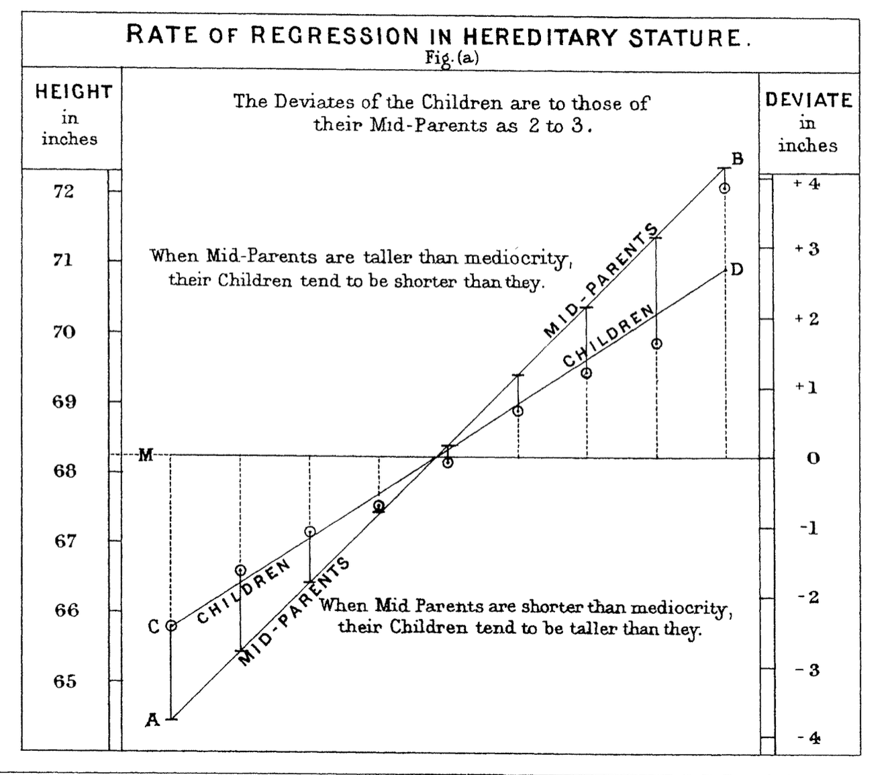
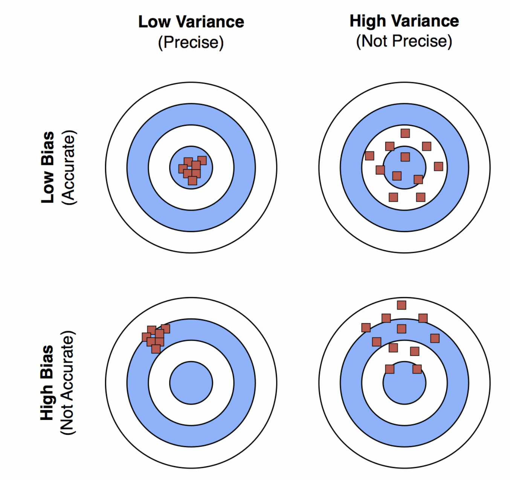
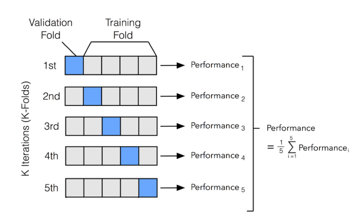

```{python}
#| echo: false
import numpy as np
import pandas as pd
import matplotlib.pyplot as plt
import seaborn as sns

plt.rcParams["figure.figsize"] = (9, 3.4)
plt.rcParams["figure.dpi"] = 110
plt.rcParams["font.size"] = 11
sns.set_theme(style="whitegrid", palette="colorblind")
pd.set_option("display.width", 100)

url = "https://raw.githubusercontent.com/damien-dupre/data/refs/heads/master/gapminder.csv"
gapminder = pd.read_csv(url).rename(columns={"lifeExp": "life_exp", "gdpPercap": "gdp_per_cap"})
g2007 = gapminder.query("year == 2007").copy()
g2007["log_gdp"] = np.log(g2007["gdp_per_cap"])
```

## For Today

#### Requirements

- ✅ pandas and seaborn
- ✅ A cleaned project dataset with a numeric outcome
- ✅ Assessment 4 in progress

#### Programme

1. From description to prediction
2. Correlation and the line of best fit
3. Fitting a model with statsmodels
4. Predicting with scikit-learn
5. Evaluating honestly

### Any questions?

## Setup

```{python}
#| eval: false
import numpy as np
import pandas as pd
import matplotlib.pyplot as plt
import seaborn as sns
import statsmodels.formula.api as smf

from sklearn.model_selection import train_test_split
from sklearn.linear_model import LinearRegression
from sklearn.metrics import mean_squared_error, r2_score

url = "https://raw.githubusercontent.com/damien-dupre/data/refs/heads/master/gapminder.csv"
gapminder = pd.read_csv(url).rename(columns={"lifeExp": "life_exp", "gdpPercap": "gdp_per_cap"})
g2007 = gapminder.query("year == 2007").copy()
g2007["log_gdp"] = np.log(g2007["gdp_per_cap"])
```

# 1. From Description to Prediction

## The Three Questions

1. **Description**: what is the mean life expectancy in Europe? *Weeks 7 and 8.*
2. **Explanation**: is income associated with life expectancy, and how strongly? *Today, part 1.*
3. **Prediction**: given a country's income, what life expectancy would we expect? *Today, part 2.*

The same model answers 2 and 3. The difference is what you do with it, and how you check it.

## Why "Regression"?

{width="52%" fig-align="center"}

::: {.small-font}
Francis Galton, 1886. Tall parents have tall children, but slightly closer to the average: children "regress towards mediocrity". The method kept the name.
:::

## The Question for Today

> **Can we predict a country's life expectancy from its income?**

```{python}
#| echo: false
fig, ax = plt.subplots()
sns.scatterplot(data=g2007, x="gdp_per_cap", y="life_exp", ax=ax, alpha=0.8)
ax.set_xlabel("GDP per capita in 2007 (US$)")
ax.set_ylabel("Life expectancy (years)")
plt.show()
```

## The Warning Label

::: {.callout-important}
A model finds **association**, not causation. Nothing today proves that raising income raises life expectancy.

Richer countries also have better healthcare, sanitation, education and food security. The model cannot separate them, and it does not try to.
:::

You may say: *"in 2007, countries with higher income had higher life expectancy"*.

You may not say: *"income causes life expectancy"*.

# 2. Correlation and the Line

## Correlation

The correlation coefficient `r` measures the strength of a **linear** relationship, between -1 and +1.

```{python}
print(g2007["gdp_per_cap"].corr(g2007["life_exp"]).round(3))
```

```{python}
print(g2007[["life_exp", "gdp_per_cap", "pop"]].corr().round(2))
```

## Correlation Only Sees Straight Lines

```{python}
print("raw GDP: ", g2007["gdp_per_cap"].corr(g2007["life_exp"]).round(3))
print("log GDP: ", g2007["log_gdp"].corr(g2007["life_exp"]).round(3))
```

The relationship did not change. Only its **shape** did, and correlation only understands one shape.

::: {.callout-tip}
This is why lecture 9 insisted on plotting first. A correlation of 0.68 with a curved cloud and a correlation of 0.81 with a straight one are different situations.
:::

## Why the Log

- Going from \$500 to \$1,000 a year transforms a country's healthcare
- Going from \$40,000 to \$40,500 changes nothing
- What matters is the **proportional** change, not the absolute one
- `log()` turns proportional changes into equal steps

This is not a trick to improve the number. It is a claim about how the world works, and the plot supports it.

## Your Turn: Correlation and Shape {background="#43464B"}

Using the 2007 data:

1. Compute the correlation between `life_exp` and `gdp_per_cap`, then between `life_exp` and `log_gdp`
2. Plot both relationships side by side. Which one could a straight line describe?
3. Compute the correlation between `life_exp` and `pop`. Plot it. Does the number match what you see?
4. Repeat question 1 for **1952**. Was income as strongly related to life expectancy then?

::: {#timer1 .timer seconds="660" starton="interaction"}
:::

## Solution

```{python}
#| echo: false
fig, axes = plt.subplots(1, 2, figsize=(9, 2.9))
sns.scatterplot(data=g2007, x="gdp_per_cap", y="life_exp", ax=axes[0], alpha=0.7)
axes[0].set_xlabel("GDP per capita (US$)")
axes[0].set_ylabel("Life expectancy")
axes[0].set_title(f"r = {g2007['gdp_per_cap'].corr(g2007['life_exp']):.2f}", fontsize=10)

sns.scatterplot(data=g2007, x="log_gdp", y="life_exp", ax=axes[1], alpha=0.7)
axes[1].set_xlabel("log(GDP per capita)")
axes[1].set_ylabel("")
axes[1].set_title(f"r = {g2007['log_gdp'].corr(g2007['life_exp']):.2f}", fontsize=10)
plt.tight_layout()
plt.show()
```

```{python}
#| echo: false
g1952_ = gapminder.query("year == 1952").assign(log_gdp=lambda d: np.log(d["gdp_per_cap"]))
print("pop vs life_exp, 2007: ", round(g2007["pop"].corr(g2007["life_exp"]), 3))
print("log_gdp vs life_exp, 1952:", round(g1952_["log_gdp"].corr(g1952_["life_exp"]), 3))
```

Population is essentially unrelated to life expectancy, and the plot agrees: a formless cloud. **A correlation near zero and a correlation you have not plotted are not the same thing.**

## The Line of Best Fit

```{python}
#| echo: false
fig, ax = plt.subplots()
sns.regplot(data=g2007, x="log_gdp", y="life_exp", ax=ax,
            scatter_kws={"alpha": 0.7}, line_kws={"color": "#C44E52"})
ax.set_xlabel("log(GDP per capita), 2007")
ax.set_ylabel("Life expectancy (years)")
plt.show()
```

## What "Best" Means

The model is a straight line:

$$\text{life\_exp} = \beta_0 + \beta_1 \times \text{log\_gdp} + \varepsilon$$

- $\beta_0$ the **intercept**: the predicted value when `log_gdp` is 0
- $\beta_1$ the **slope**: the change in life expectancy for a one-unit change in `log_gdp`
- $\varepsilon$ the **residual**: what the line fails to explain, for each country

"Best" means the line that makes the **sum of squared residuals** as small as possible. Hence *ordinary least squares*, OLS.

## Residuals, Visually

```{python}
#| echo: false
import statsmodels.formula.api as smf
mini = g2007.sample(25, random_state=1)
fit_mini = smf.ols("life_exp ~ log_gdp", data=mini).fit()
mini = mini.assign(pred=fit_mini.fittedvalues)

fig, ax = plt.subplots()
ax.scatter(mini["log_gdp"], mini["life_exp"], zorder=3)
ax.plot(mini["log_gdp"].sort_values(),
        fit_mini.predict(mini.sort_values("log_gdp")), color="#C44E52")
ax.vlines(mini["log_gdp"], mini["life_exp"], mini["pred"],
          color="#999999", linewidth=1)
ax.set_xlabel("log(GDP per capita)")
ax.set_ylabel("Life expectancy (years)")
ax.set_title("Each grey line is one residual", loc="left", fontsize=12)
plt.show()
```

# 3. Fitting a Model

## statsmodels

```{python}
import statsmodels.formula.api as smf

model = smf.ols("life_exp ~ log_gdp", data=g2007)
results = model.fit()
```

- `smf.ols` builds the model, `.fit()` estimates it
- The **formula** `"y ~ x"` reads *"life expectancy explained by log GDP"*
- The syntax is borrowed from R, and is far more readable than the alternatives

## The Summary

```{python}
print(results.summary().tables[1])
```

- `coef`: the estimates. Intercept 4.95, slope 7.20
- `P>|t|`: the p-value. Below 0.05 by convention, here effectively zero
- `[0.025 0.975]`: the 95% confidence interval for the slope

## Reading the Coefficients

```{python}
print(results.params.round(3))
```

> Each **one-unit increase in log GDP per capita** is associated with **7.2 more years** of life expectancy.

One unit of log is a multiplication by $e \approx 2.72$. In plain English:

```{python}
print("A doubling of income:", round(results.params["log_gdp"] * np.log(2), 2), "years")
```

## Goodness of Fit

```{python}
print("R-squared:", round(results.rsquared, 3))
print("Residual std error:", round(np.sqrt(results.scale), 2), "years")
```

- $R^2$ is the share of the variation in life expectancy the model accounts for: 65%
- The other 35% is everything else: conflict, epidemics, geography, policy
- The typical miss is about 7 years, which is a lot

::: {.callout-warning}
A high $R^2$ does not mean the model is right, and a low one does not mean it is useless. Judge a model by what it is for.
:::

## Checking the Assumptions

```{python}
#| echo: false
fig, axes = plt.subplots(1, 2, figsize=(9, 2.9))

axes[0].scatter(results.fittedvalues, results.resid, alpha=0.7)
axes[0].axhline(0, color="#C44E52")
axes[0].set_xlabel("Fitted values")
axes[0].set_ylabel("Residuals")
axes[0].set_title("Residuals vs fitted", fontsize=10)

import scipy.stats as stats
stats.probplot(results.resid, dist="norm", plot=axes[1])
axes[1].set_title("Normal Q-Q", fontsize=10)
axes[1].get_lines()[0].set_alpha(0.7)

plt.tight_layout()
plt.show()
```

- **Left**: a shapeless cloud around zero is good. A curve means the relationship is not linear.
- **Right**: points on the line mean the residuals are roughly normal.

## Adding a Second Predictor

```{python}
multi = smf.ols("life_exp ~ log_gdp + C(continent)", data=g2007).fit()
print(multi.params.round(2))
```

- `+` adds a predictor
- `C()` marks a column as **categorical**: pandas creates the indicator columns for you
- Africa is missing because it is the **reference**: every other coefficient is relative to it

## Interpreting the Multiple Model

```{python}
print("R-squared:", round(multi.rsquared, 3), "  (simple model:", round(results.rsquared, 3), ")")
```

> **Holding income constant**, a European country has on average 5.9 more years of life expectancy than an African country.

"Holding constant" is the entire value of multiple regression. It is also where honesty is required: the model holds constant only what you put in it.

## Your Turn: Fit a Model {background="#43464B"}

1. Fit `life_exp ~ log_gdp` on the **1952** data. How does the slope compare with 2007?
2. Fit `life_exp ~ log_gdp + np.log(pop)` on 2007. Does population add anything?
3. Report $R^2$ for both models
4. Plot residuals against fitted values for your best model. Is there a pattern?

::: {#timer2 .timer seconds="840" starton="interaction"}
:::

## Solution

```{python}
g1952 = gapminder.query("year == 1952").assign(log_gdp=lambda d: np.log(d["gdp_per_cap"]))

fit52 = smf.ols("life_exp ~ log_gdp", data=g1952).fit()
fit07 = smf.ols("life_exp ~ log_gdp", data=g2007).fit()
print("1952 slope:", round(fit52.params['log_gdp'], 2), " R2:", round(fit52.rsquared, 3))
print("2007 slope:", round(fit07.params['log_gdp'], 2), " R2:", round(fit07.rsquared, 3))

with_pop = smf.ols("life_exp ~ log_gdp + np.log(pop)", data=g2007).fit()
print("with pop  R2:", round(with_pop.rsquared, 3),
      " p-value for pop:", round(with_pop.pvalues['np.log(pop)'], 3))
```

Population adds nothing: the p-value is far above 0.05 and $R^2$ barely moves.

# 4. Prediction

## Explanation vs Prediction

- **Explanation** asks: is this coefficient real, and what does it mean? Use statsmodels.
- **Prediction** asks: how close will my guess be for a country I have never seen? Use scikit-learn.

The second question cannot be answered on the data used to fit the model. That would be marking your own homework.

## Train and Test

```{python}
from sklearn.model_selection import train_test_split

X = g2007[["log_gdp"]]      # a DataFrame: note the double brackets
y = g2007["life_exp"]       # a Series

X_train, X_test, y_train, y_test = train_test_split(
    X, y, test_size=0.25, random_state=42
)
print(X_train.shape, X_test.shape)
```

- `X` the predictors, `y` the outcome. This naming is universal.
- 75% to train, 25% held back and never looked at until the end
- `random_state` makes the split reproducible

## Fit and Predict

```{python}
from sklearn.linear_model import LinearRegression

model = LinearRegression()
model.fit(X_train, y_train)

print("intercept:", round(model.intercept_, 2))
print("slope:    ", round(model.coef_[0], 2))
```

The same numbers as statsmodels, from a different interface. scikit-learn gives no p-values and no summary: it is built for prediction, not inference.

## The scikit-learn Pattern

```{python}
#| eval: false
model = SomeModel()          # 1. choose
model.fit(X_train, y_train)  # 2. learn
model.predict(X_new)         # 3. predict
```

Those three lines are identical for linear regression, decision trees, random forests, gradient boosting and neural networks. **Learn the pattern once and every model in the library is available to you.**

## Predicting for New Data

```{python}
new_countries = pd.DataFrame({"log_gdp": np.log([2000, 10000, 45000])})
predictions = model.predict(new_countries)

for gdp, pred in zip([2000, 10000, 45000], predictions):
    print(f"GDP per capita {gdp:>6,}: predicted life expectancy {pred:.1f} years")
```

::: {.callout-warning}
Never predict outside the range of the data you fitted on. The model would happily give you a life expectancy of 130 for an income of ten million. It has never seen such a country and neither have you.
:::

## How Good Is It?

```{python}
from sklearn.metrics import mean_squared_error, mean_absolute_error, r2_score

y_pred = model.predict(X_test)

print("R2:  ", round(r2_score(y_test, y_pred), 3))
print("RMSE:", round(np.sqrt(mean_squared_error(y_test, y_pred)), 2), "years")
print("MAE: ", round(mean_absolute_error(y_test, y_pred), 2), "years")
```

- **RMSE**: typical error, in the units of the outcome, punishing large misses
- **MAE**: the average miss, easier to explain to a non-technical audience
- Both computed on the **test** set, which the model never saw

## Predicted vs Actual

```{python}
#| echo: false
fig, ax = plt.subplots(figsize=(6.5, 3.4))
ax.scatter(y_test, y_pred, alpha=0.8)
lims = [y_test.min() - 2, y_test.max() + 2]
ax.plot(lims, lims, color="#C44E52", linestyle="--")
ax.set_xlabel("Actual life expectancy (years)")
ax.set_ylabel("Predicted (years)")
ax.set_title("Points on the dashed line are perfect predictions", loc="left", fontsize=11)
plt.show()
```

## Does the Categorical Help?

```{python}
X2 = pd.get_dummies(g2007[["log_gdp", "continent"]], drop_first=True, dtype=float)
X2_train, X2_test, y_train2, y_test2 = train_test_split(X2, y, test_size=0.25, random_state=42)

model2 = LinearRegression().fit(X2_train, y_train2)
pred2 = model2.predict(X2_test)

print("simple  RMSE:", round(np.sqrt(mean_squared_error(y_test, y_pred)), 2))
print("with continent RMSE:", round(np.sqrt(mean_squared_error(y_test2, pred2)), 2))
```

`get_dummies` is scikit-learn's equivalent of `C()`: it turns a text column into indicator columns. `drop_first=True` avoids the redundancy the reference category handles in statsmodels.

## Your Turn: Predict {background="#43464B"}

Using **your own project dataset**:

1. Choose a numeric outcome and one or two numeric predictors
2. Split into train and test with `random_state=42`
3. Fit a `LinearRegression`, and report $R^2$, RMSE and MAE on the test set
4. Predict for three plausible new observations you invent
5. Plot predicted against actual, with the diagonal line

::: {#timer3 .timer seconds="1140" starton="interaction"}
:::

# 5. Being Honest About a Model

## Overfitting

- A model with enough parameters can fit **any** training data perfectly
- It will then perform terribly on anything new
- This is why the test set exists, and why you only use it once

```{python}
#| echo: false
rng = np.random.default_rng(3)
xs = np.linspace(0, 10, 12)
ys = 2 + 0.8 * xs + rng.normal(0, 1.6, 12)
grid = np.linspace(0, 10, 200)

fig, axes = plt.subplots(1, 2, figsize=(9, 2.6))
for ax, deg, title in zip(axes, [1, 11], ["Straight line: fits the pattern", "Degree 11: fits the noise"]):
    ax.scatter(xs, ys, zorder=3)
    ax.plot(grid, np.polyval(np.polyfit(xs, ys, deg), grid), color="#C44E52")
    ax.set_ylim(min(ys) - 3, max(ys) + 3)
    ax.set_title(title, fontsize=10)
plt.tight_layout()
plt.show()
```

## The Bias-Variance Trade-off

{width="60%" fig-align="center"}

::: {.small-font}
Too simple: the model misses the pattern everywhere (bias). Too complex: the model chases the noise and changes wildly with new data (variance). Source: Boston University, [DS701 Tools for Data Science](https://github.com/tools4ds/DS701-Course-Notes).
:::

## What a Linear Model Assumes

- The relationship is **linear**, after any transformation you applied
- Observations are **independent**: one country does not determine another
- Residuals have roughly **constant spread** across the range
- Residuals are roughly **normal**, which matters for p-values, not for prediction

Our gapminder model violates independence: neighbouring countries share history, climate and trade. The coefficients remain useful; the p-values are optimistic.

## Things That Will Catch You Out

- **Extrapolation**: predicting outside the observed range
- **Data leakage**: a predictor that secretly contains the answer
- **Simpson's paradox**: a relationship that reverses within groups
- **Correlated predictors**: two columns measuring the same thing make both coefficients unstable
- **Fishing**: trying 40 models and reporting the one with a p-value below 0.05

## The Sentence You Are Allowed to Write

> In 2007, across 142 countries, log GDP per capita accounted for 65% of the variation in life expectancy. A doubling of income was associated with about 5 additional years, and this association held after accounting for continent. Predictions on held-out countries missed by about 7 years on average, so income alone is a weak basis for predicting any individual country.

Numbers, uncertainty, scope, and no causal claim. That is what a competent analyst writes.

## Your Turn: The Write-Up {background="#43464B"}

Write, in a text cell under your model, a paragraph of **five sentences at most** that states:

1. What you predicted, from what, on what data
2. The direction and size of the main effect, in real units
3. How much variation the model accounts for
4. How wrong a typical prediction is
5. One reason to distrust the model

::: {#timer4 .timer seconds="540" starton="interaction"}
:::

# Where To Go Next

## The Model Zoo

Everything below uses the same three lines you learned today:

- **Logistic regression**: when the outcome is yes/no. Will this customer churn?
- **Decision trees and random forests**: non-linear, no transformation needed
- **Gradient boosting** (XGBoost, LightGBM): what wins most competitions on tabular data
- **Time series** (ARIMA, Prophet): when the order of rows matters
- **Clustering** (k-means): when there is no outcome to predict

## And a Better Way to Evaluate

{width="65%" fig-align="center"}

::: {.small-font}
**k-fold cross-validation**: split the data k ways, train on k-1 parts and test on the one left out, k times. Every observation gets used for testing exactly once, so the estimate does not depend on one lucky split. `sklearn.model_selection.cross_val_score` does it in one line. Source: Boston University, [DS701 Tools for Data Science](https://github.com/tools4ds/DS701-Course-Notes).
:::

## What You Have Learned in 10 Weeks

- Week 1-5: the Python language, from `print()` to your own functions
- Week 6: a professional working environment on your own machine
- Week 7-8: importing, cleaning, grouping, joining and reshaping real data
- Week 9: making it visible, and honest
- Week 10: fitting a model, predicting, and knowing what the prediction is worth

That is the full pipeline. Everything else in analytics is a variation on it.

## The Project

**60% of the module. Deadline: end of week 12.**

One notebook, containing:

1. The question, and where the data comes from
2. Import and cleaning, with your decisions explained
3. Description: a grouped summary table
4. Two or three charts, labelled and interpreted
5. One linear model, with an evaluation on held-out data
6. A conclusion of one paragraph, including what you would not claim

## Marking

| | Weight |
|:--|:--|
| Code runs from top to bottom without error | 15% |
| Cleaning: appropriate, documented, reproducible | 20% |
| Analysis: correct use of grouping and joining | 20% |
| Charts: correct form, labelled, interpreted | 20% |
| Model: fitted, evaluated, honestly discussed | 20% |
| Notebook is readable by a human | 5% |

An excellent notebook with a weak $R^2$ beats a great $R^2$ nobody can follow.

## Final Advice

- Keep a personal notebook of snippets you know work
- Redo one analysis you have done in Excel, in Python. That is when it becomes yours.
- Use AI assistants as a colleague who is fast, confident and sometimes wrong
- Put your project on GitHub: it is the only portfolio an employer can actually check

## References

- [statsmodels documentation](https://www.statsmodels.org/stable/index.html)
- [scikit-learn: Getting started](https://scikit-learn.org/stable/getting_started.html)
- James, Witten, Hastie & Tibshirani, [An Introduction to Statistical Learning, Python edition](https://www.statlearning.com/), free online
- Gchism, [Machine Learning Foundations](https://github.com/Gchism94/info521-slides-2026)
- Boston University, [DS701 Tools for Data Science](https://github.com/tools4ds/DS701-Course-Notes), for the regression and model-evaluation figures

## {background="#43464B"}

```{=html}
<style>img.circle {border-radius:50%;}</style>
```

::: {layout-ncol="2"}


**Thanks for your attention and don't hesitate to ask if you have any questions!**
[ @damien_dupre](https://datasci.social/@damien_dupre)
[ @damien-dupre](https://github.com/damien-dupre)
[ https://damien-dupre.github.io](https://damien-dupre.github.io)
[ damien.dupre@dcu.ie](mailto:damien.dupre@dcu.ie)
:::
