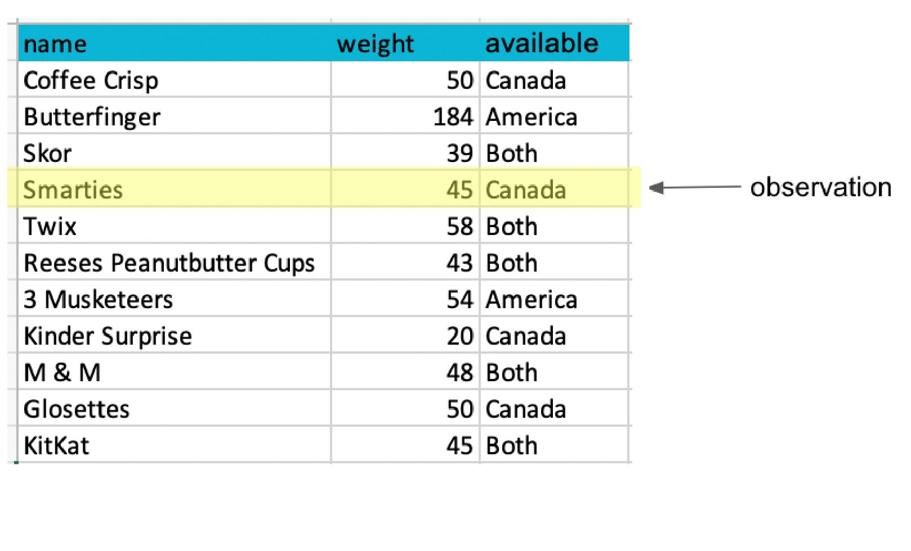
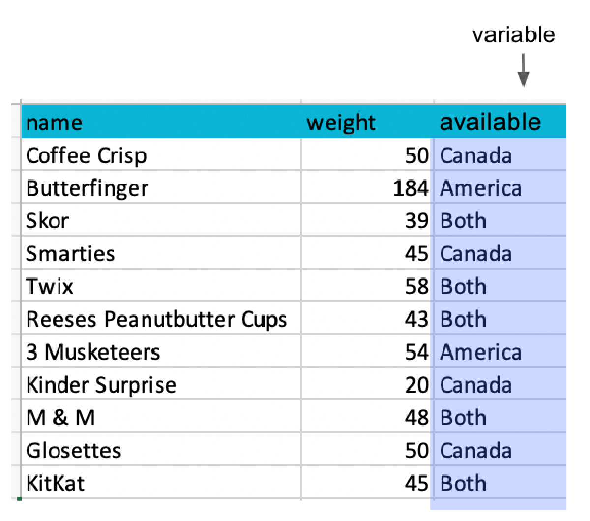

## For Today

#### Requirements

- ✅ Assigning values to names
- ✅ `int`, `float`, `str`, `bool`
- ✅ Reading an error message without panicking

#### Programme

1. Lists
2. Indexing and slicing
3. Dictionaries
4. Tuples and sets
5. Nested structures
6. How data is stored on disk

### Any questions?

## The Problem With One Value Per Name

```{python}
sales_jan = 1200
sales_feb = 1450
sales_mar = 1310
```

. . .

This works for 3 months. It does not work for 3,000 customers.

::: incremental
- You cannot loop over separate names
- You cannot ask "how many are there?"
- You cannot sort them
:::

. . .

**Collections** solve this: one name, many values.

# 1. Lists

## Creating a List

Square brackets, values separated by commas.

```{python}
sales = [1200, 1450, 1310]
print(sales)
print(type(sales))
print(len(sales))
```

. . .

A list can hold anything, including a mix of types:

```{python}
mixed = ["Ireland", 5.1, True, None]
print(mixed)
```

. . .

In practice, a useful list holds **one kind of thing**.

## Basic List Operations

```{python}
countries = ["Ireland", "France", "Spain"]

print(countries[0])          # first element
print(len(countries))        # how many
print("France" in countries) # membership
print(countries + ["Italy"]) # concatenation
```

. . .

```{python}
print(sorted([3, 1, 2]))
print(sum([1200, 1450, 1310]))
print(max([1200, 1450, 1310]))
```

## Adding and Removing

```{python}
countries = ["Ireland", "France", "Spain"]

countries.append("Italy")        # add at the end
print(countries)

countries.insert(1, "Germany")   # add at position 1
print(countries)
```

. . .

```{python}
countries.remove("France")       # remove by value
print(countries)

last = countries.pop()           # remove and return the last
print(last, countries)
```

## Methods Change the List Itself

This is the big difference with strings.

```{python}
scores = [5, 3, 9]
scores.sort()          # changes scores, returns nothing
print(scores)
```

. . .

```{python}
scores = [5, 3, 9]
result = scores.sort()
print(result)          # None!
```

. . .

::: {.callout-important}
`list.sort()` sorts in place and returns `None`. `sorted(list)` returns a new sorted list. Writing `scores = scores.sort()` destroys your data.
:::

## Your Turn: A Shopping List {background="#43464B"}

1. Create a list called `basket` with these prices: `4.50`, `12.99`, `3.25`, `8.00`
2. Add `19.99` at the end
3. Remove `3.25`
4. Print how many items are in the basket, the total, and the most expensive item
5. Print the basket sorted from cheapest to most expensive, **without changing** `basket`

::: {#timer1 .timer seconds="360" starton="interaction"}
:::

## Solution

```{python}
basket = [4.50, 12.99, 3.25, 8.00]
basket.append(19.99)
basket.remove(3.25)

print(len(basket))
print(sum(basket))
print(max(basket))
print(sorted(basket))
print(basket)      # unchanged
```

# 2. Indexing and Slicing

## Indexing From the Left

```{python}
countries = ["Ireland", "France", "Spain", "Italy", "Portugal"]
```

| Value | Ireland | France | Spain | Italy | Portugal |
|:--|:--|:--|:--|:--|:--|
| Index | 0 | 1 | 2 | 3 | 4 |

```{python}
print(countries[0])
print(countries[3])
```

. . .

```{python}
#| error: true
print(countries[5])
```

## Indexing From the Right

Negative indices count backwards, starting at `-1`.

| Value | Ireland | France | Spain | Italy | Portugal |
|:--|:--|:--|:--|:--|:--|
| Index | 0 | 1 | 2 | 3 | 4 |
| | -5 | -4 | -3 | -2 | -1 |

```{python}
print(countries[-1])
print(countries[-2])
```

. . .

`countries[-1]` is how you get the last element without knowing the length.

## Slicing

`list[start:stop]` returns a **new list**, from `start` **up to but not including** `stop`.

```{python}
print(countries[0:2])
print(countries[1:4])
```

. . .

Leaving a side empty means "all the way":

```{python}
print(countries[:2])    # from the start
print(countries[2:])    # to the end
print(countries[:])     # a full copy
```

## Slicing With a Step

`list[start:stop:step]`

```{python}
numbers = [0, 1, 2, 3, 4, 5, 6, 7, 8, 9]

print(numbers[::2])     # every second element
print(numbers[1::2])    # every second, starting at 1
print(numbers[::-1])    # reversed
```

. . .

`[::-1]` reversing a sequence is a Python classic. It works on strings too:

```{python}
print("Python"[::-1])
```

## Changing Elements

Lists are **mutable**: elements can be replaced.

```{python}
countries = ["Ireland", "France", "Spain"]
countries[1] = "Germany"
print(countries)
```

. . .

A whole slice can be replaced:

```{python}
countries[0:2] = ["Belgium", "Austria"]
print(countries)
```

## The Copy Trap

```{python}
a = [1, 2, 3]
b = a          # b is not a copy!
b.append(4)
print(a)
```

. . .

`b = a` gives the **same list** a second name. To copy:

```{python}
a = [1, 2, 3]
b = a.copy()   # or list(a), or a[:]
b.append(4)
print(a, b)
```

. . .

::: {.callout-warning}
This trap reappears in week 7 with DataFrames, where pandas warns you about it explicitly.
:::

## Your Turn: Slicing Quarters {background="#43464B"}

```{.python}
monthly = [120, 135, 148, 160, 155, 149, 171, 168, 180, 190, 205, 240]
```

1. Print the first quarter (first 3 months) and its total
2. Print the last quarter and its total
3. Print every third month
4. Print the list in reverse
5. Replace the value for June (index 5) with `152` and print the new annual total

::: {#timer2 .timer seconds="420" starton="interaction"}
:::

## Solution

```{python}
monthly = [120, 135, 148, 160, 155, 149, 171, 168, 180, 190, 205, 240]

q1 = monthly[:3]
q4 = monthly[-3:]
print(q1, sum(q1))
print(q4, sum(q4))
print(monthly[::3])
print(monthly[::-1])

monthly[5] = 152
print(sum(monthly))
```

# 3. Dictionaries

## The Problem With Positions

```{python}
customer = ["Damien", 42, "Dublin", 1250.50]
```

. . .

What is `customer[2]`? You have to remember. In six months, you will not.

. . .

A **dictionary** stores values by **name** instead of by position.

```{python}
customer = {
    "name": "Damien",
    "age": 42,
    "city": "Dublin",
    "spend": 1250.50
}
print(customer["city"])
```

## Anatomy of a Dictionary

```{python}
#| eval: false
{key: value, key: value}
```

::: incremental
- Curly braces `{}`
- Each entry is a **key**, a colon, and a **value**
- Keys are usually strings, and must be unique
- Values can be anything, including lists and other dictionaries
:::

. . .

Think of it as a two-column lookup table, or a single row of a spreadsheet with its column headers.

## Reading and Writing

```{python}
customer = {"name": "Damien", "city": "Dublin", "spend": 1250.50}

print(customer["name"])       # read
customer["spend"] = 1400.00   # update
customer["country"] = "IE"    # add a new key
print(customer)
```

. . .

```{python}
#| error: true
print(customer["email"])
```

## get(): Reading Safely

```{python}
print(customer.get("email"))                     # None instead of an error
print(customer.get("email", "not provided"))     # with a default
```

. . .

This matters when the data comes from somewhere you do not control, which is always.

## Exploring a Dictionary

```{python}
print(customer.keys())
print(customer.values())
```

. . .

```{python}
print("city" in customer)     # tests the keys
print(len(customer))
```

. . .

```{python}
for key, value in customer.items():
    print(key, "->", value)
```

We will unpack that `for` line properly next week.

## Removing

```{python}
customer.pop("country")
print(customer)
```

. . .

```{python}
del customer["spend"]
print(customer)
```

# 4. Tuples and Sets

## Tuples: Lists That Cannot Change

Round brackets instead of square ones.

```{python}
coordinates = (53.3853, -6.2450)
print(coordinates[0])
print(len(coordinates))
```

. . .

```{python}
#| error: true
coordinates[0] = 0
```

. . .

Use a tuple when the collection is **not supposed to change**: a coordinate, a date, a pair of values returned by a function.

## Unpacking

```{python}
latitude, longitude = coordinates
print(latitude)
print(longitude)
```

. . .

This works for lists too, and is used constantly:

```{python}
first, second, third = ["a", "b", "c"]
print(second)
```

. . .

You will see it in week 9 as `fig, ax = plt.subplots()`.

## Sets: Unique Values Only

```{python}
regions = ["North", "South", "North", "East", "South", "North"]
unique_regions = set(regions)
print(unique_regions)
print(len(unique_regions))
```

. . .

Sets are unordered and cannot be indexed. Their job is answering *"which distinct values are in this column?"*, which is the first question you ask of any dataset.

## Set Operations

```{python}
customers_2023 = {"A", "B", "C", "D"}
customers_2024 = {"C", "D", "E"}

print(customers_2023 & customers_2024)   # retained
print(customers_2023 - customers_2024)   # churned
print(customers_2024 - customers_2023)   # new
print(customers_2023 | customers_2024)   # all
```

. . .

Four lines of business analytics with no library at all.

## The Four Collections

| | Syntax | Ordered | Changeable | Duplicates |
|:--|:--|:--|:--|:--|
| list | `[1, 2, 3]` | yes | yes | yes |
| tuple | `(1, 2, 3)` | yes | no | yes |
| dict | `{"a": 1}` | yes | yes | keys: no |
| set | `{1, 2, 3}` | no | yes | no |

. . .

In practice: **list** for a column of values, **dict** for a labelled record, **set** for uniqueness, **tuple** for fixed pairs.

## Your Turn: A Customer Record {background="#43464B"}

1. Create a dictionary `customer` with keys `id`, `name`, `city` and `orders`, where `orders` is a **list** of order amounts: `45.0`, `120.5`, `33.25`
2. Add a new order of `78.0` to the list inside the dictionary
3. Print the number of orders and the total spent
4. Print the average order value, rounded to 2 decimals, using an f-string
5. Safely print the value of a key `email` that does not exist

::: {#timer3 .timer seconds="540" starton="interaction"}
:::

## Solution

```{python}
customer = {
    "id": "C001",
    "name": "Damien",
    "city": "Dublin",
    "orders": [45.0, 120.5, 33.25]
}

customer["orders"].append(78.0)

n = len(customer["orders"])
total = sum(customer["orders"])

print(n, total)
print(f"Average order: {total / n:.2f}")
print(customer.get("email", "no email on file"))
```

# 5. Nested Structures

## A List of Dictionaries

This is how almost all real data arrives, from an API, a JSON file, or a database.

```{python}
customers = [
    {"name": "Damien", "city": "Dublin", "spend": 1250.50},
    {"name": "Aoife",  "city": "Cork",   "spend": 890.00},
    {"name": "Liam",   "city": "Dublin", "spend": 2100.75}
]

print(len(customers))
print(customers[1])
print(customers[1]["city"])
```

## Reading Nested Data

Read the brackets **left to right**:

```{python}
#| eval: false
customers[1]["city"]
# customers        -> the list
# customers[1]     -> the second dictionary
# ["city"]         -> the value under "city" in that dictionary
```

. . .

```{python}
print(customers[2]["spend"])
print(customers[-1]["name"])
```

## Why This Matters

```{python}
customers
```

. . .

Turn your head sideways: **names across the top, one record per row**. This is a table.

## A Table Has Two Directions

:::: {layout="[1,1]"}
::: {#first-column}
Each **row** is one observation: one product, one customer, one country-year.


:::

::: {#second-column}
Each **column** is one variable: one thing measured about every observation.


:::
::::

::: {.small-font}
Source: UBC Master of Data Science, [Programming in Python for Data Science](https://prog-learn.mds.ubc.ca/)
:::

. . .

In week 7, one line converts it:

```{python}
import pandas as pd
pd.DataFrame(customers)
```

That is where we are going.

## Your Turn: Nested Data {background="#43464B"}

```{.python}
sales = [
    {"month": "Jan", "region": "North", "units": 120},
    {"month": "Jan", "region": "South", "units": 95},
    {"month": "Feb", "region": "North", "units": 138},
    {"month": "Feb", "region": "South", "units": 101}
]
```

1. Print the number of records
2. Print the region of the third record
3. Print the units of the last record
4. Add a fifth record for March, North, 150 units
5. Print the total units of the **first two** records only

::: {#timer4 .timer seconds="420" starton="interaction"}
:::

## Solution

```{python}
sales = [
    {"month": "Jan", "region": "North", "units": 120},
    {"month": "Jan", "region": "South", "units": 95},
    {"month": "Feb", "region": "North", "units": 138},
    {"month": "Feb", "region": "South", "units": 101}
]

print(len(sales))
print(sales[2]["region"])
print(sales[-1]["units"])

sales.append({"month": "Mar", "region": "North", "units": 150})

print(sales[0]["units"] + sales[1]["units"])
```

. . .

Adding up the whole column still needs a loop. That is next week.

# 6. Data on Disk

## Where Data Actually Lives

Everything so far has been typed into the notebook. Real data arrives as a **file**, and you
will meet four formats over and over.

| Format | Looks like | Holds |
|:--|:--|:--|
| `.csv` | plain text, one row per line | one table |
| `.json` | plain text, nested brackets | anything, including nested records |
| `.xlsx` | a binary Excel document | several sheets, plus formatting and formulas |
| `.parquet` | a binary data file | one table, with its types and compressed |

. . .

Today you only need to **recognise** them and know what shape of Python each one maps onto.
Reading them comes in week 5.

## CSV: A Table as Text

**C**omma **S**eparated **V**alues. Open it in a text editor and you can read it:

```{.default filename="roasted_stores.csv"}
store,city,county,seats,floor_m2
Grafton Street,Dublin,Dublin,42,96
Camden Street,Dublin,Dublin,28,64
Blanchardstown,Dublin,Dublin,60,140
```

::: incremental
- First line: the column names
- One line per row, values separated by commas
- **No types.** `42` is the text "42" until something decides otherwise
- Nothing else: no formulas, no colours, no second sheet
:::

. . .

That is a **list of dictionaries** written down. It is the format you should ask for.

## The CSV Trap

```{.default filename="a_real_export.csv"}
name,city,note
"Murphy, John",Cork,"He said ""grand"" and left"
Ó Súilleabháin,Baile Átha Cliath,
```

::: incremental
- A comma **inside** a value, so the value is quoted
- A quote inside a quoted value, so it is doubled
- An empty value at the end of the line
- Accented characters, which need the file to be saved as UTF-8
:::

. . .

This is why you never split a CSV by hand with `.split(",")`. A proper reader handles all of
it, and you will use one from week 5.

## JSON: Python, Written Down

**J**ava**S**cript **O**bject **N**otation. Look closely at this:

```{.default filename="customers.json"}
[
  {"id": "C0148", "name": "Aoife",   "store": "Grafton Street", "spend": 24.90},
  {"id": "C0201", "name": "Cian",    "store": "Camden Street",  "spend": 61.40},
  {"id": "C0377", "name": "Saoirse", "store": "Grafton Street", "spend": 9.80}
]
```

. . .

You wrote that ten minutes ago. **JSON is a list of dictionaries, saved as text.** Square
brackets for a list, curly braces for a dictionary, colons for keys.

## JSON: Python, Written Down

The `json` module turns one into the other. Imports are next week's topic, so read this
rather than worrying about the first line:

```{python}
import json

text = '[{"name": "Aoife", "spend": 24.90}, {"name": "Cian", "spend": 61.40}]'
customers = json.loads(text)

print(type(customers))
print(type(customers[0]))
print(customers[1]["spend"])
```

. . .

Almost every website and app sends its data as JSON, precisely because it can hold nested
structures that a table cannot: a customer with a **list** of orders inside them.

## JSON Can Nest, CSV Cannot

```{.default filename="orders.json"}
{
  "customer": "C0148",
  "orders": [
    {"date": "2025-03-04", "drinks": ["Latte", "Flat White"], "total": 8.20},
    {"date": "2025-03-11", "drinks": ["Cortado"],             "total": 3.40}
  ]
}
```

::: incremental
- A dictionary, containing a list, containing dictionaries, containing a list
- There is no way to write that in a CSV without flattening it
- Which is why the first job with JSON data is usually deciding **what one row should be**
:::

## Excel: A Document, Not a Data File

An `.xlsx` file is a zipped folder of XML. It can hold:

::: incremental
- Several sheets
- Formulas that recalculate
- Merged cells, colours, comments, charts, pivot tables
- Three different date formats in the same column
:::

. . .

::: {.callout-warning}
Excel is excellent for people and awkward for code. When you are given one, expect a title
row above the headers, a blank column somebody used as a spacer, and totals in the middle
of the data. Half of week 7 is dealing with exactly that.
:::

## Parquet: The One Built for Data

```{.default}
PAR1 ... (binary, unreadable in a text editor) ... PAR1
```

::: incremental
- **Typed**: a date column comes back as a date, not as text
- **Columnar**: reading one column of a hundred does not read the other ninety-nine
- **Compressed**: usually a third the size of the same CSV
- **Unreadable by humans**, and that is the whole trade
:::

. . .

It is the standard for data that is passed between systems rather than emailed to a person.
You will meet it in any serious data job, and almost never in an inbox.

## Which Format, When

| You are... | Use |
|:--|:--|
| Sending a table to a colleague | `.csv` |
| Given a spreadsheet by a colleague | `.xlsx`, and expect to clean it |
| Reading from a website or an API | `.json` |
| Saving a cleaned table for your own next step | `.parquet` |
| Told "the data is in the warehouse" | `.parquet`, whether you see it or not |

. . .

Same four functions read all of them, and you meet them next week. **The format is a
container. What comes out is always the same table.**

## What We Have Seen

::: incremental
- **list**: ordered, changeable, indexed from 0
- Slicing `[start:stop:step]`, stop excluded
- Mutability, and why `b = a` is not a copy
- **dict**: values retrieved by key, `get()` for safety
- **tuple**: fixed, unpackable
- **set**: unique values, and set arithmetic
- Nesting: a list of dictionaries is a table waiting to happen
- CSV, JSON, Excel and Parquet, and which Python structure each one maps onto
:::

## Before Next Week

::: incremental
1. **Assessment 1 is open**, covering weeks 1 to 3, due at the start of week 5
2. Take the `sales` list from the last exercise and write down, in a text cell, how you would total the units if there were 5,000 records
3. Next week gives you the answer: loops
:::

## References

- Charles Severance, [Python for Everybody](https://www.py4e.com/), chapters 8, 9 and 10
- [Real Python: Lists and Tuples](https://realpython.com/python-lists-tuples/)
- [Real Python: Dictionaries](https://realpython.com/python-dicts/)
- UBC Master of Data Science, [Programming in Python for Data Science](https://prog-learn.mds.ubc.ca/), for the diagrams and animations

## {background="#43464B"}

```{=html}
<style>img.circle {border-radius:50%;}</style>
```

::: {layout-ncol="2"}


**Thanks for your attention and don't hesitate to ask if you have any questions!**
[ @damien_dupre](https://datasci.social/@damien_dupre)
[ @damien-dupre](https://github.com/damien-dupre)
[ https://damien-dupre.github.io](https://damien-dupre.github.io)
[ damien.dupre@dcu.ie](mailto:damien.dupre@dcu.ie)
:::
