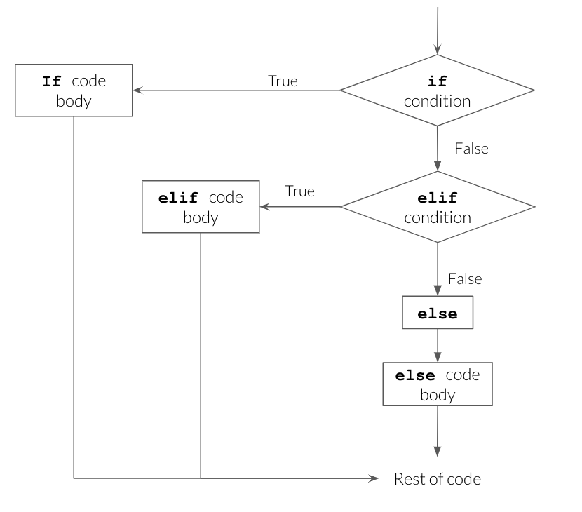
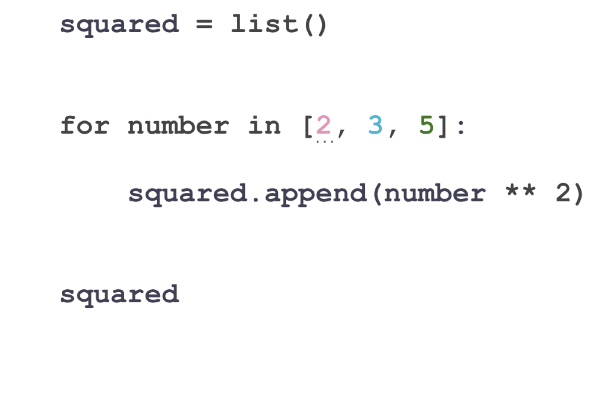

## For Today

#### Requirements

- ✅ Lists, dictionaries, indexing and slicing
- ✅ Comparisons returning `True` or `False`
- ✅ Assessment 1 submitted or in progress

#### Programme

1. Conditions: `if`, `elif`, `else`
2. `for` loops
3. `while` loops
4. `break`, `continue` and comprehensions

### Any questions?

## Straight Line Code

Everything so far has run **top to bottom, once**.

```{python}
units = 340
price = 12.99
print(units * price)
```

. . .

Real analysis needs two more things:

::: incremental
- Doing something **only sometimes**: conditions
- Doing something **many times**: loops
:::

. . .

Together they are called **control flow**: you control the order in which lines run.

# 1. Conditions

## if

```{python}
spend = 1250

if spend > 1000:
    print("Premium customer")
```

::: incremental
- The line starts with `if` and ends with a **colon**
- The block underneath is **indented**
- The block runs only when the condition is `True`
:::

## Indentation Is Syntax

In most languages, indentation is decoration. In Python, it **is the code**.

```{python}
#| error: true
if spend > 1000:
print("Premium")
```

. . .

The convention is **4 spaces**. Colab and VS Code insert them for you when you press <kbd>Enter</kbd> after a colon.

::: {.callout-warning}
Never mix tabs and spaces. It produces errors that are invisible on screen.
:::

## if / else

```{python}
spend = 450

if spend > 1000:
    print("Premium customer")
else:
    print("Standard customer")
```

. . .

`else` has no condition. It catches everything the `if` did not.

## if / elif / else

```{python}
spend = 450

if spend > 1000:
    segment = "Premium"
elif spend > 500:
    segment = "Gold"
elif spend > 100:
    segment = "Silver"
else:
    segment = "Bronze"

print(segment)
```

::: incremental
- Conditions are tested **in order**, top to bottom
- The **first** true one runs, the rest are skipped
- Order therefore matters enormously
:::

## if / elif / else

{width="60%" fig-align="center"}

::: {.small-font}
Source: UBC Master of Data Science, [Programming in Python for Data Science](https://prog-learn.mds.ubc.ca/)
:::

## Order Matters

```{python}
spend = 1250

if spend > 100:
    segment = "Silver"
elif spend > 1000:
    segment = "Premium"

print(segment)
```

. . .

The customer spent €1,250 and was labelled Silver, because `> 100` was tested first and won.

**Write cut-offs from the most restrictive to the least.**

## Combining Conditions

```{python}
age = 34
spend = 1250

if age < 40 and spend > 1000:
    print("Young high spender")

if age > 65 or spend > 2000:
    print("Priority contact")

if not spend > 1000:
    print("Not a big spender")
```

## Truthiness

Python accepts any value where a condition is expected.

```{python}
print(bool(0), bool(42))
print(bool(""), bool("text"))
print(bool([]), bool([1, 2]))
print(bool(None))
```

. . .

So this is idiomatic Python:

```{python}
orders = []

if not orders:
    print("This customer has no orders")
```

## Nested Conditions

```{python}
country = "IE"
spend = 1250

if country == "IE":
    if spend > 1000:
        print("Irish premium")
    else:
        print("Irish standard")
else:
    print("International")
```

. . .

Each level adds 4 spaces. Beyond two levels, the code is hard to read: combine with `and` instead.

## Your Turn: Grading {background="#43464B"}

Write code that turns a mark out of 100 into a DCU grade:

| Mark | Grade |
|:--|:--|
| 70 and above | First |
| 60 to 69 | 2H1 |
| 50 to 59 | 2H2 |
| 40 to 49 | Pass |
| below 40 | Fail |

1. Store a mark in a variable, produce the grade with `if` / `elif` / `else`
2. Print it with an f-string: `A mark of 64 is a 2H1`
3. Test it with 70, 39, 100 and 60

::: {#timer1 .timer seconds="420" starton="interaction"}
:::

## Solution

```{python}
mark = 64

if mark >= 70:
    grade = "First"
elif mark >= 60:
    grade = "2H1"
elif mark >= 50:
    grade = "2H2"
elif mark >= 40:
    grade = "Pass"
else:
    grade = "Fail"

print(f"A mark of {mark} is a {grade}")
```

. . .

Note that `>=` is doing the work: with `>` a mark of exactly 70 would be a 2H1.

# 2. for Loops

## Repeating Over a Collection

Last week's problem: totalling a list without `sum()`.

```{python}
sales = [120, 135, 148, 160]

total = 0
for value in sales:
    total = total + value

print(total)
```

. . .

Read it as English: *"for each value in sales, add it to total"*.

## Anatomy of a for Loop

```{python}
#| eval: false
for item in collection:
    do_something_with(item)
```

::: incremental
- `item` is a **new variable you name**, holding one element at a time
- `collection` is a list, string, dictionary, or anything iterable
- The colon and the indented block, exactly as with `if`
- The block runs once per element
:::

## Watching It Run

{width="55%" fig-align="center"}

::: {.small-font}
Source: UBC Master of Data Science, [Programming in Python for Data Science](https://prog-learn.mds.ubc.ca/)
:::

## Watching It Run

```{python}
for country in ["Ireland", "France", "Spain"]:
    print("Now processing:", country)
```

. . .

The loop variable survives after the loop, holding the last value:

```{python}
print(country)
```

## range()

For a fixed number of repetitions, `range()` generates the numbers.

```{python}
for i in range(5):
    print(i)
```

. . .

`range(5)` gives 0, 1, 2, 3, 4: **five numbers, starting at zero, stopping before 5**. The same rule as slicing.

```{python}
print(list(range(2, 8)))
print(list(range(0, 10, 2)))
```

## The Accumulator Pattern

Three lines you will write for the rest of your life:

```{python}
sales = [120, 135, 148, 160]

# 1. start empty
total = 0
count = 0

# 2. loop, updating
for value in sales:
    total += value
    count += 1

# 3. use the result
print(total, count, total / count)
```

## Building a New List

```{python}
prices = [10.0, 25.0, 8.5]
prices_with_vat = []

for price in prices:
    prices_with_vat.append(round(price * 1.23, 2))

print(prices_with_vat)
```

. . .

Start with an empty list, `append()` inside the loop. This is the second most common loop pattern.

## Filtering Inside a Loop

Conditions and loops combine naturally:

```{python}
spends = [45, 1200, 380, 2500, 90]
big_spenders = []

for spend in spends:
    if spend > 1000:
        big_spenders.append(spend)

print(big_spenders)
print(len(big_spenders), "customers above 1000")
```

## Looping Over a Dictionary

```{python}
customer = {"name": "Damien", "city": "Dublin", "spend": 1250.50}

for key in customer:
    print(key)
```

. . .

```{python}
for key, value in customer.items():
    print(f"{key}: {value}")
```

. . .

`.items()` gives both at once, and the two loop variables are unpacked exactly as with tuples.

## Looping Over Nested Data

```{python}
sales = [
    {"month": "Jan", "region": "North", "units": 120},
    {"month": "Jan", "region": "South", "units": 95},
    {"month": "Feb", "region": "North", "units": 138}
]

total_north = 0
for record in sales:
    if record["region"] == "North":
        total_north += record["units"]

print(total_north)
```

. . .

Eight lines. In week 8, pandas does this in one: `df.groupby("region")["units"].sum()`.

## enumerate() and zip()

When you need the position as well as the value:

```{python}
countries = ["Ireland", "France", "Spain"]

for i, country in enumerate(countries):
    print(i, country)
```

. . .

When you need to walk two lists together:

```{python}
units = [120, 95, 138]

for country, unit in zip(countries, units):
    print(f"{country}: {unit}")
```

## Your Turn: Loop Practice {background="#43464B"}

```{.python}
monthly = [120, 135, 148, 160, 155, 149, 171, 168, 180, 190, 205, 240]
months = ["Jan","Feb","Mar","Apr","May","Jun","Jul","Aug","Sep","Oct","Nov","Dec"]
```

1. Loop to compute the total and the mean, without `sum()`
2. Build a list `growth` holding each month's value **minus the previous one** (11 values)
3. Print the name of every month above 170 units, using `zip()`
4. Count how many months were above the mean

::: {#timer2 .timer seconds="660" starton="interaction"}
:::

## Solution

```{python}
monthly = [120, 135, 148, 160, 155, 149, 171, 168, 180, 190, 205, 240]
months = ["Jan","Feb","Mar","Apr","May","Jun","Jul","Aug","Sep","Oct","Nov","Dec"]

total = 0
for value in monthly:
    total += value
mean = total / len(monthly)
print(total, round(mean, 1))

growth = []
for i in range(1, len(monthly)):
    growth.append(monthly[i] - monthly[i - 1])
print(growth)

for month, value in zip(months, monthly):
    if value > 170:
        print(month)

above = 0
for value in monthly:
    if value > mean:
        above += 1
print(above, "months above average")
```

# 3. while Loops

## Repeating Until

A `for` loop runs a known number of times. A `while` loop runs **until a condition stops being true**.

```{python}
balance = 1000
years = 0

while balance < 2000:
    balance = balance * 1.05
    years += 1

print(years, round(balance, 2))
```

. . .

We did not know in advance that it would take 15 years. That is exactly when `while` is the right tool.

## The Infinite Loop

```{python}
#| eval: false
count = 0
while count < 10:
    print(count)     # count never changes: this never ends
```

::: {.callout-important}
Every `while` loop must contain a line that eventually makes the condition false. If Colab hangs, press the stop button, or `Runtime -> Interrupt execution`.
:::

. . .

In practice, 95% of the loops you write in analytics are `for` loops.

## break and continue

```{python}
for value in [45, 1200, 380, 2500, 90]:
    if value > 1000:
        print("Found a big spender:", value)
        break            # stop the loop entirely
```

. . .

```{python}
for value in [45, None, 380, None, 90]:
    if value is None:
        continue         # skip to the next iteration
    print(value * 2)
```

. . .

`continue` is how you skip missing values without crashing.

## Your Turn: Until and Skip {background="#43464B"}

1. A savings account holds €5,000 and grows 3% a year. Using a `while` loop, find how many years until it passes €10,000.
2. Change the rate to 6% and rerun. Does the answer halve?
3. This list contains missing readings:

```{.python}
readings = [12.5, None, 15.0, None, 9.8, 21.3]
```

Loop over it with `continue` to compute the mean of the values that exist, without crashing.

4. Using `break`, print the **first** reading above 15 and stop.

::: {#timer4 .timer seconds="540" starton="interaction"}
:::

## Solution

```{python}
balance = 5000
years = 0
while balance < 10000:
    balance *= 1.03
    years += 1
print(years, "years at 3%")
```

```{python}
readings = [12.5, None, 15.0, None, 9.8, 21.3]

total = 0
count = 0
for r in readings:
    if r is None:
        continue
    total += r
    count += 1
print(round(total / count, 2))

for r in readings:
    if r is not None and r > 15:
        print("First above 15:", r)
        break
```

. . .

24 years at 3%, 12 years at 6%. Here doubling the rate does halve the time, which is the "rule of 72" in action. Try 1% and 2% and the pattern holds; try 40% and it does not.

# 4. Comprehensions

## The Loop, Compressed

Building a list with a loop:

```{python}
prices = [10.0, 25.0, 8.5]

with_vat = []
for price in prices:
    with_vat.append(price * 1.23)
print(with_vat)
```

. . .

The same thing, in one line:

```{python}
with_vat = [price * 1.23 for price in prices]
print(with_vat)
```

## Reading a Comprehension

```{python}
#| eval: false
[expression for item in collection]
#     ^          ^        ^
#   what to    the loop variable
#   store      and where it comes from
```

. . .

Read it backwards: *"for each price in prices, store price times 1.23"*.

```{python}
print([c.upper() for c in ["ireland", "france"]])
print([n ** 2 for n in range(6)])
```

## Comprehension With a Condition

```{python}
spends = [45, 1200, 380, 2500, 90]

big = [s for s in spends if s > 1000]
print(big)
```

. . .

And a condition on the value stored:

```{python}
labels = ["big" if s > 1000 else "small" for s in spends]
print(labels)
```

. . .

::: {.callout-tip}
If a comprehension no longer fits comfortably on one line, write it as a normal loop. Clever is not a goal.
:::

## Why Bother?

::: incremental
- Shorter, and once you are used to it, clearer
- It is everywhere in real Python code, so you must be able to **read** it
- It hints at the next idea: **vectorisation**
:::

## Loops Are Not the Destination

```{python}
import pandas as pd

prices = pd.Series([10.0, 25.0, 8.5])
prices * 1.23
```

. . .

No loop. The operation applies to the whole column at once, and it is roughly 100 times faster on real data.

::: incremental
- You still need loops: for files, for models, for anything not column-shaped
- But from week 7, **if you are writing a loop over rows of a table, there is usually a better way**
:::

## Your Turn: Comprehensions {background="#43464B"}

```{.python}
temps_c = [12.5, 15.0, 9.8, 21.3, 18.7, 4.2]
```

1. Build `temps_f` converting each to Fahrenheit: `f = c * 9/5 + 32`
2. Build a list of temperatures above 15 only
3. Build a list of labels: `"warm"` if above 15, `"cold"` otherwise
4. Rewrite question 1 as a normal `for` loop, and check the two give the same result

::: {#timer3 .timer seconds="420" starton="interaction"}
:::

## Solution

```{python}
temps_c = [12.5, 15.0, 9.8, 21.3, 18.7, 4.2]

temps_f = [c * 9/5 + 32 for c in temps_c]
print(temps_f)

print([c for c in temps_c if c > 15])
print(["warm" if c > 15 else "cold" for c in temps_c])

loop_version = []
for c in temps_c:
    loop_version.append(c * 9/5 + 32)
print(loop_version == temps_f)
```

## What We Have Seen

::: incremental
- `if` / `elif` / `else`, tested in order, first match wins
- Indentation is part of the language
- `for item in collection:` and the accumulator pattern
- `range()`, `enumerate()`, `zip()`
- `while` for "until", with the infinite loop risk
- `break` and `continue`
- List comprehensions as a compact loop
:::

## Before Next Week

::: incremental
1. **Assessment 1 is due at the start of week 5**
2. Rewrite the grading exercise so it works on a **list** of marks and prints one line per student
3. Next week: packaging all of this into functions you can reuse
:::

## References

- Charles Severance, [Python for Everybody](https://www.py4e.com/), chapters 3 and 5
- [Real Python: Conditional Statements](https://realpython.com/python-conditional-statements/)
- [Real Python: List Comprehensions](https://realpython.com/list-comprehension-python/)
- UBC Master of Data Science, [Programming in Python for Data Science](https://prog-learn.mds.ubc.ca/), for the diagrams and animations

## {background="#43464B"}

```{=html}
<style>img.circle {border-radius:50%;}</style>
```

::: {layout-ncol="2"}


**Thanks for your attention and don't hesitate to ask if you have any questions!**
[ @damien_dupre](https://datasci.social/@damien_dupre)
[ @damien-dupre](https://github.com/damien-dupre)
[ https://damien-dupre.github.io](https://damien-dupre.github.io)
[ damien.dupre@dcu.ie](mailto:damien.dupre@dcu.ie)
:::
