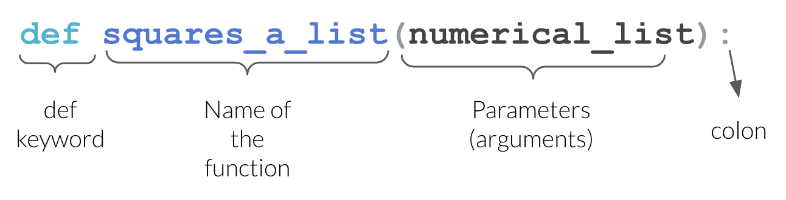

## For Today

#### Requirements

- ✅ Conditions and loops
- ✅ Building a list inside a loop
- ✅ Assessment 1 submitted

#### Programme

1. Why functions
2. Defining a function
3. Arguments and scope
4. Modules and packages
5. Paths, and getting data into Colab
6. Reading documentation

### Any questions?

## Where We Are

You can now:

::: incremental
- Store data in lists and dictionaries
- Decide with `if`
- Repeat with `for`
:::

. . .

That is a complete programming language. Everything from here is about **not writing the same thing twice**.

# 1. Why Functions

## The Copy-Paste Problem

```{python}
prices_a = [10.0, 25.0, 8.5]
prices_b = [4.0, 19.5]

total_a = 0
for p in prices_a:
    total_a += p * 1.23

total_b = 0
for p in prices_b:
    total_b += p * 1.23

print(round(total_a, 2), round(total_b, 2))
```

. . .

Two nearly identical blocks. Now the VAT rate changes to 24%. How many places do you edit? How many do you forget?

## Functions You Already Use

```{python}
print(len([1, 2, 3]))
print(round(3.14159, 2))
print(sum([1, 2, 3]))
```

::: incremental
- You give **inputs** in the brackets: the *arguments*
- You get an **output** back: the *return value*
- You have no idea how `sum()` is written internally, and you do not need to
:::

. . .

Writing your own is the same idea, applied to your problem.

## The Three Reasons

::: incremental
1. **Do not repeat yourself.** One definition, one place to fix.
2. **Name your intention.** `compute_gross(net)` says what the four lines inside actually mean.
3. **Test once.** If the function is right, every use of it is right.
:::

# 2. Defining a Function

## def

```{python}
def add_vat(net):
    gross = net * 1.23
    return gross
```

::: incremental
- `def` starts the definition
- `add_vat` is the name, in `snake_case`
- `net` is the **parameter**: a name that exists inside the function
- Colon, then an indented block
- `return` sends a value back to the caller
:::

. . .

Defining a function **runs nothing**. It only creates the tool.

## The def Line

{width="85%" fig-align="center"}

::: {.small-font}
Source: UBC Master of Data Science, [Programming in Python for Data Science](https://prog-learn.mds.ubc.ca/)
:::

## Calling a Function

```{python}
print(add_vat(100))
print(add_vat(1847.35))
```

. . .

The value in the brackets is the **argument**. It is copied into the parameter `net` for the duration of the call.

```{python}
invoice = 250
print(add_vat(invoice))
```

## return vs print

This is the most common beginner confusion.

```{python}
def add_vat_print(net):
    print(net * 1.23)

def add_vat_return(net):
    return net * 1.23
```

. . .

```{python}
a = add_vat_print(100)
print(a)
```

. . .

```{python}
b = add_vat_return(100)
print(b * 2)
```

. . .

**`print` shows a human. `return` gives a value back to the program.** Analysis functions return.

## return Ends the Function

```{python}
def check_spend(spend):
    if spend > 1000:
        return "Premium"
    return "Standard"

print(check_spend(1500))
print(check_spend(200))
```

. . .

The moment a `return` runs, the function stops. No `else` is needed here.

## Docstrings

The first string inside a function documents it.

```{python}
def add_vat(net, rate=0.23):
    """Return the gross amount for a net amount and a VAT rate.

    net:  the amount before VAT, in euros
    rate: the VAT rate as a decimal, 0.23 by default
    """
    return net * (1 + rate)

help(add_vat)
```

. . .

Three lines of docstring now save you an hour in March.

## Your Turn: Your First Functions {background="#43464B"}

1. Write `celsius_to_fahrenheit(c)` returning `c * 9/5 + 32`. Test it on 0 and 100.
2. Write `margin(revenue, cost)` returning the profit margin as a **percentage**, rounded to 1 decimal.
3. Write `grade(mark)` returning the DCU grade from lecture 4, as a function this time.
4. Give each one a one-line docstring.

::: {#timer1 .timer seconds="540" starton="interaction"}
:::

## Solution

```{python}
def celsius_to_fahrenheit(c):
    """Convert a temperature from Celsius to Fahrenheit."""
    return c * 9/5 + 32

def margin(revenue, cost):
    """Return the profit margin as a percentage, to 1 decimal."""
    return round((revenue - cost) / revenue * 100, 1)

def grade(mark):
    """Return the DCU grade band for a mark out of 100."""
    if mark >= 70:
        return "First"
    elif mark >= 60:
        return "2H1"
    elif mark >= 50:
        return "2H2"
    elif mark >= 40:
        return "Pass"
    return "Fail"

print(celsius_to_fahrenheit(100), margin(1000, 620), grade(64))
```

# 3. Arguments and Scope

## Several Parameters

```{python}
def net_profit(revenue, cost, tax_rate):
    gross = revenue - cost
    return gross * (1 - tax_rate)

print(net_profit(10000, 6000, 0.125))
```

. . .

Arguments are matched **by position**, in order. Get the order wrong and you get a wrong answer with no error:

```{python}
print(net_profit(0.125, 6000, 10000))
```

## Keyword Arguments

Name the arguments and position stops mattering:

```{python}
print(net_profit(revenue=10000, cost=6000, tax_rate=0.125))
print(net_profit(tax_rate=0.125, revenue=10000, cost=6000))
```

. . .

::: {.callout-tip}
Use keywords whenever a function takes more than two arguments. Your future self reading `net_profit(10000, 6000, 0.125)` will not remember which is which.
:::

## Default Values

```{python}
def add_vat(net, rate=0.23):
    return net * (1 + rate)

print(add_vat(100))            # uses the default
print(add_vat(100, 0.135))     # overrides it
print(add_vat(100, rate=0.09))
```

::: incremental
- Parameters with defaults are **optional**
- They must come after the parameters without defaults
- This is how `round(x)` and `round(x, 2)` can both work
:::

## Scope

Names created inside a function only exist inside it.

```{python}
#| error: true
def compute():
    hidden = 42
    return hidden * 2

print(compute())
print(hidden)
```

. . .

This is a feature: a function cannot silently break the rest of your notebook.

## Scope, The Other Direction

A function **can** read names from outside:

```{python}
vat_rate = 0.23

def add_vat_global(net):
    return net * (1 + vat_rate)   # reads the outside name

print(add_vat_global(100))
```

. . .

::: {.callout-warning}
This works, and it is a trap. The function now depends on something invisible in its own definition. Change `vat_rate` elsewhere and the function quietly changes behaviour. **Pass what you need as a parameter.**
:::

## Functions Calling Functions

```{python}
def add_vat(net, rate=0.23):
    return net * (1 + rate)

def invoice_total(prices, rate=0.23):
    """Return the gross total of a list of net prices."""
    total = 0
    for price in prices:
        total += add_vat(price, rate)
    return round(total, 2)

print(invoice_total([10.0, 25.0, 8.5]))
print(invoice_total([10.0, 25.0, 8.5], rate=0.09))
```

. . .

Small functions combined beat one large one, every time.

## Returning Several Values

```{python}
def describe(values):
    """Return the count, total and mean of a list of numbers."""
    n = len(values)
    total = sum(values)
    return n, total, total / n

count, total, mean = describe([120, 135, 148, 160])
print(count, total, round(mean, 1))
```

. . .

Python returns a **tuple**, which you unpack exactly as in lecture 3.

## Your Turn: A Reusable Summary {background="#43464B"}

1. Write `summarise(values)` returning the minimum, maximum, mean and range of a list. Do not use `statistics`.
2. Unpack the four values and print them with an f-string, mean to 2 decimals.
3. Write `clean_text(text)` that strips spaces, lowercases, and replaces any `"-"` with a space.
4. Test `clean_text` on `"  Dublin-City  "`.

::: {#timer2 .timer seconds="540" starton="interaction"}
:::

## Solution

```{python}
def summarise(values):
    """Return min, max, mean and range of a list of numbers."""
    lo = min(values)
    hi = max(values)
    mean = sum(values) / len(values)
    return lo, hi, mean, hi - lo

lo, hi, mean, spread = summarise([120, 135, 148, 160, 240])
print(f"min {lo}, max {hi}, mean {mean:.2f}, range {spread}")

def clean_text(text):
    """Strip, lowercase and replace dashes with spaces."""
    return text.strip().lower().replace("-", " ")

print(clean_text("  Dublin-City  "))
```

# 4. Modules and Packages

## Python Comes With Batteries

The **standard library** is installed with Python. You just have to `import` it.

```{python}
import math

print(math.sqrt(144))
print(math.pi)
print(math.log(100, 10))
```

. . .

`math.sqrt` reads as *"the sqrt function from the math module"*. The dot means "inside".

## Useful Standard Modules

```{python}
import random
random.seed(42)                     # makes randomness reproducible
print(random.randint(1, 6))
print(random.choice(["A", "B", "C"]))
```

. . .

```{python}
import statistics
values = [120, 135, 148, 160, 240]
print(statistics.mean(values), statistics.median(values))
```

. . .

```{python}
from datetime import date
print(date.today().year)
```

## Three Ways to Import

```{python}
#| eval: false
import math                 # math.sqrt(16)
import pandas as pd         # pd.read_csv(...)
from math import sqrt       # sqrt(16)
```

::: incremental
- `import x`: safest, always clear where a function comes from
- `import x as y`: the standard for the big data libraries, and the alias is conventional, not arbitrary
- `from x import y`: convenient, but hides the origin
:::

. . .

```{python}
#| eval: false
from math import *          # never do this
```

## The Conventional Aliases

```{python}
#| eval: false
import numpy as np
import pandas as pd
import matplotlib.pyplot as plt
import seaborn as sns
import statsmodels.formula.api as smf
```

. . .

These five lines open almost every data analysis notebook in the world. **Use exactly these aliases**: any code you find online assumes them.

## The Python Ecosystem


::: {.small-font}
Source: Neuroinformatics Unit, UCL, [Introduction to Python](https://neuroinformatics.dev/course-intro-python)
:::

You will use six of these. The rest exist, and they all install the same way.

## Packages Are Not Modules

::: incremental
- A **module** is one `.py` file of code
- A **package** is a collection of modules, distributed together
- The standard library is included with Python
- Everything else has to be **installed**
:::

. . .

```{python}
#| eval: false
!pip install seaborn                 # in Colab, or any notebook cell
pip install seaborn                  # in a terminal
python -m pip install seaborn        # in a terminal, the safe form
```

. . .

`pip` is Python's package installer. `python -m pip` runs it through a **named** interpreter, which removes all doubt about where the package lands. More on that in week 6.

## Installing vs Importing

Two separate steps, and confusing them is a rite of passage:

::: incremental
- **Install** once per machine or environment: downloads the code
- **Import** once per session: makes it available in this notebook
:::

. . .

```{python}
#| error: true
import definitely_not_a_real_package
```

`ModuleNotFoundError` means it is not installed, or the name is misspelt.

. . .

Colab has pandas, numpy, matplotlib, seaborn, scikit-learn and statsmodels pre-installed. From week 6 you will install them yourself.

# 5. Paths and Getting Data Into Colab

## Four Formats, Four Readers

Week 3 introduced CSV, JSON, Excel and Parquet. pandas reads all four, and the pattern is
always the same: `pd.read_something(where_it_is)`.

```{python}
#| eval: false
import pandas as pd

stores  = pd.read_csv("roasted_stores.csv")
sales   = pd.read_excel("quarterly_report.xlsx", sheet_name="Q1")
orders  = pd.read_json("orders.json")
daily   = pd.read_parquet("roasted_daily.parquet")
```

. . .

Four different files on disk, four one-line calls, and **the same DataFrame out of each**.
That is the whole reason the formats do not matter much once the file is in reach.

## Two of Them Need a Helper

`read_csv` and `read_json` are built in. The other two are not:

::: incremental
- `read_excel` needs **openpyxl**
- `read_parquet` needs **pyarrow**
:::

```{python}
#| eval: false
!pip install openpyxl pyarrow
```

. . .

Colab has both pre-installed, so today it just works. On your own machine next week it will
not, and you will install them yourself. Remember the distinction from twenty minutes ago:
**installed once per environment, imported once per session.**

## But Where Is the File?

`pd.read_csv("roasted_stores.csv")` looks for that file **on the machine running Python**.

. . .

In Colab, that machine is a virtual computer in a Google data centre. Your file is on your
laptop. They have never met.

. . .

Before we bridge that gap, we need to be able to say **where a file is**. That is a path.

## What a Path Actually Is

A path is a file's address: the folders you pass through, then the file name.

```{.default}
/Users/damien/Documents/BAA1118/data/roasted_stores.csv
└─┬──┘ └──┬─┘ └───┬────┘ └──┬───┘ └─┬─┘ └────────┬─────────┘
 root   user    folder    folder  folder      file name
```

::: incremental
- **Absolute**: starts at the root and works on no other machine but this one
- **Relative**: starts from wherever Python currently is, and travels with the project
- The **separator** is `/` on macOS and Linux, and `\` on Windows, although Windows accepts
  `/` too and you should always give it one
- `~` is a shortcut for your home folder
:::

## Roots Look Different

```{python}
#| eval: false
# macOS and Linux: one root, called /
"/Users/damien/Documents/BAA1118/data/stores.csv"
"~/Documents/BAA1118/data/stores.csv"

# Windows: one root per drive
"C:/Users/damien/Documents/BAA1118/data/stores.csv"

# Google Colab: a Linux machine, and you start in /content
"/content/stores.csv"
```

. . .

Notice the last one. In Colab you are not on your own computer at all, and the path reflects
that: `/content` is a folder on a machine you will never see again after today.

## The Colab Filesystem

Colab's runtime has a disk of its own. Ask it where you are:

```{python}
#| eval: false
!pwd            # print working directory  ->  /content
!ls             # what is in it
!ls /content
```

::: incremental
- You start in `/content`
- Anything you upload lands in `/content`
- The **folder icon** in the left sidebar is a file browser for exactly this
- All of it is deleted when the runtime stops
:::

. . .

`!` at the start of a line means "run this as a terminal command, not as Python". It is a
Colab and Jupyter convenience, not part of the language.

## Do Not Type the Path. Copy It.

Once a file is in Colab:

::: incremental
1. Click the **folder icon** in the left sidebar
2. Find your file
3. Right-click it, choose **Copy path**
4. Paste it between the quotes of `pd.read_csv("")`
:::

. . .

```{python}
#| eval: false
df = pd.read_csv("/content/roasted_stores.csv")
```

. . .

Typing a path by hand is how you spend ten minutes on a typo. **Copy it, every time.**

## Three Paths That Will Not Work

```{python}
#| eval: false
# 1. Incomplete: where does /path start? Nowhere on this machine.
pd.read_csv("/path/to/my/file.csv")

# 2. Missing the extension: "file" and "file.csv" are different names
pd.read_csv("C:/Users/damien/data/file")

# 3. Backslashes in a normal string: \t and \f are not folders
pd.read_csv("C:\Users\damien\data\file.csv")
```

. . .

The third one is the cruel one. `\t` means tab and `\f` means form feed, so Python never
even sees the folder names. Use forward slashes, or put an `r` before the quote:
`r"C:\Users\damien\data\file.csv"`.

## FileNotFoundError Is Not Mysterious

```{python}
#| eval: false
pd.read_csv("stores.csv")
```

```{.default}
FileNotFoundError: [Errno 2] No such file or directory: 'stores.csv'
```

. . .

Ignore the twenty lines of traceback above it and read that last line. It means exactly
what it says. Four checks, in order, and they take twenty seconds:

::: incremental
1. `!pwd` and `!ls`: am I where I think I am, and is the file there?
2. Is the **extension** in the name? Windows and macOS both hide them by default.
3. Is the **spelling and the capitalisation** right? `Stores.csv` is a different file.
4. Did I copy the path, or type it?
:::

## Capitals Matter Here, But Not At Home

::: {.callout-warning}
**Windows and macOS do not care about capitals. Colab does.**
:::

Your own laptop will happily open `Stores.csv` when you asked for `stores.csv`, so the bug
stays invisible until the code runs somewhere else.

```{python}
#| eval: false
pd.read_csv("Stores.csv")   # works on your Mac or PC
pd.read_csv("stores.csv")   # the same file, also works there
```

. . .

Colab runs on Linux, where those are **two different files** and one of them does not exist.
The same is true of every server your code will ever run on, including the one marking it.

. . .

**Type the name exactly as it appears**, capitals and all, or copy it. Lower case
everywhere, always, is the habit that makes this a non-issue.

## Three Ways to Bridge the Gap

Now that we can name a file, the three ways to put one where Colab can see it, and what
each one costs.

## Option 1: Read Straight From a URL

If the file is on the public internet, pandas will fetch it:

```{python}
#| eval: false
url = "https://raw.githubusercontent.com/damien-dupre/data/refs/heads/master/gapminder.csv"
gapminder = pd.read_csv(url)
```

::: incremental
- One line, no uploading, works every time the runtime restarts
- Which is why every dataset in this module is hosted this way
- **But**: only for files that are public. Your employer's sales data is not.
:::

## Option 2: Upload By Hand

```{python}
#| eval: false
from google.colab import files
uploaded = files.upload()          # opens a file picker

sales = pd.read_csv("my_sales.csv")
```

::: incremental
- A button appears, you choose the file, it copies to the runtime
- Works for anything, including private data
- **But**: the file lives in the runtime, so it disappears when the runtime does
- Which means you re-upload it. Every session. By hand.
:::

## Option 3: Mount Google Drive

```{python}
#| eval: false
from google.colab import drive
drive.mount("/content/drive")

sales = pd.read_csv("/content/drive/MyDrive/BAA1118/data/my_sales.csv")
```

::: incremental
- The file persists between sessions, because it is in Drive rather than the runtime
- **But**: you authorise it in a pop-up every session
- **But**: your data now has to live in Google Drive
- **But**: look at that path. `/content/drive/MyDrive/...` is not where your file is.
:::

## The Pattern You Should Notice

```{python}
#| eval: false
# What you want to write:
sales = pd.read_csv("data/my_sales.csv")

# What Colab makes you write:
from google.colab import drive
drive.mount("/content/drive")
sales = pd.read_csv("/content/drive/MyDrive/BAA1118/data/my_sales.csv")
```

. . .

::: {.callout-important}
All three options are workarounds for one fact: **the file is not on the machine running
your code.** Nothing you do in Colab fixes that. Next week we move Python onto the machine
where your files already are, and the first line becomes the only line.
:::

## Reading From an Excel File

Since a colleague will send you one within a month:

```{python}
#| eval: false
# Every sheet name in the workbook
pd.ExcelFile("report.xlsx").sheet_names

# One named sheet
pd.read_excel("report.xlsx", sheet_name="Q1 Sales")

# The third sheet, whatever it is called
pd.read_excel("report.xlsx", sheet_name=2)

# Skip a title row above the headers
pd.read_excel("report.xlsx", sheet_name="Q1 Sales", skiprows=2)

# Everything, as a dictionary of DataFrames
pd.read_excel("report.xlsx", sheet_name=None)
```

. . .

`sheet_name=None` giving you a **dictionary of DataFrames** is the reason lecture 3 spent
time on dictionaries.


# 6. Getting Help

## help() and ?

```{python}
help(round)
```

. . .

In Colab and Jupyter, `round?` in a cell shows the same thing in a panel, and <kbd>Shift</kbd>+<kbd>Tab</kbd> inside the brackets shows the arguments as you type.

## Reading a Function Signature

```{python}
#| eval: false
pandas.read_csv(filepath_or_buffer, sep=',', header='infer', names=None,
                index_col=None, usecols=None, ...)
```

::: incremental
- The **first** parameter has no default: it is required
- Everything with an `=` is optional
- The order of optional arguments does not matter if you name them
- `...` means there are 40 more you will never need
:::

. . .

You are not expected to memorise these. You are expected to **find them**.

## Where to Look, In Order

::: incremental
1. `help(function)` or <kbd>Shift</kbd>+<kbd>Tab</kbd> in the notebook
2. The official documentation: [docs.python.org](https://docs.python.org), [pandas.pydata.org](https://pandas.pydata.org/docs/)
3. A search engine, with the library name in the query
4. An AI assistant, asking it to **explain** rather than just produce
5. Stack Overflow, reading the accepted answer *and* the comments below it
:::

## Asking an Assistant Well

Weak:

> write a function for vat

. . .

Strong:

> Write a Python function `add_vat(net, rate=0.23)` that returns the gross amount rounded to 2 decimals. Include a docstring. Then show me three calls that test it, including one edge case.

. . .

Notice: the **signature is yours**. You decide what the function should look like; the assistant fills it in.

## Your Turn: Read the Documentation {background="#43464B"}

Without searching the web, use `help()` in Colab to answer:

1. What does the second argument of `round()` do, and what happens if you leave it out?
2. `sorted()` has an argument that reverses the order. What is it called?
3. `enumerate()` has an argument that changes the starting number. Find it, then print your list of countries numbered from 1 instead of 0.
4. Write `clean(text, lower=True)`: it strips spaces always, and lowercases only when `lower` is `True`. Test both.

::: {#timer4 .timer seconds="540" starton="interaction"}
:::

## Solution

```{python}
countries = ["Ireland", "France", "Spain"]

print(sorted([3, 1, 2], reverse=True))

for i, country in enumerate(countries, start=1):
    print(i, country)

def clean(text, lower=True):
    """Strip a string, and lowercase it unless lower is False."""
    text = text.strip()
    if lower:
        text = text.lower()
    return text

print(clean("  Dublin  "))
print(clean("  Dublin  ", lower=False))
```

. . .

`round(x)` with no second argument returns an integer; `round(x, 0)` returns a float. Small difference, occasionally annoying.

## Your Turn: Modules {background="#43464B"}

1. Import `statistics` and compute the mean, median and standard deviation of `[12, 15, 9, 21, 18, 4]`
2. Import `random`, set the seed to `1`, and simulate 10 dice rolls in a list comprehension
3. Count how many of your rolls were 5 or more
4. Use `help()` on `random.randint` and say what its two arguments are
5. Read the gapminder CSV straight from its URL with `pd.read_csv()`, and print its shape

::: {#timer3 .timer seconds="540" starton="interaction"}
:::

## Solution

```{python}
import statistics
import random

values = [12, 15, 9, 21, 18, 4]
print(statistics.mean(values), statistics.median(values))
print(round(statistics.stdev(values), 2))

random.seed(1)
rolls = [random.randint(1, 6) for _ in range(10)]
print(rolls)
print(len([r for r in rolls if r >= 5]))
```

. . .

```{python}
import pandas as pd

url = "https://raw.githubusercontent.com/damien-dupre/data/refs/heads/master/gapminder.csv"
print(pd.read_csv(url).shape)
```

. . .

`_` is the conventional name for a loop variable you do not use.

## What We Have Seen

::: incremental
- `def name(parameters):` and `return`
- `return` gives a value back, `print` only shows it
- Positional, keyword and default arguments
- Scope: inside stays inside, and passing beats reading globals
- Docstrings and `help()`
- `import`, the conventional aliases, install vs import
- What a path is: absolute vs relative, roots, separators, `~`
- `/content` in Colab, the sidebar file browser, and **Copy path**
- The three paths that never work, and the four checks for `FileNotFoundError`
- `read_csv`, `read_excel`, `read_json`, `read_parquet`, and the three awkward ways to put a
  file where Colab can see it
:::

## Half Time

::: incremental
- You have the whole language: values, collections, conditions, loops, functions
- You know what the four file formats are, which function reads each one, and how to write
  the path to a file
- Everything from now on is **libraries**: other people's functions, applied to data
- Week 6 moves you off Colab and onto your own machine
- Weeks 7 to 10 are one continuous analysis: import, clean, aggregate, visualise, predict
:::

## Before Next Week

::: {.callout-important}
Next week is a **practical setup lecture**. Bring your laptop, charged, with administrator rights if it is a work machine.
:::

If you can, download these two installers for your operating system **in advance**. DCU wifi will not enjoy 60 people downloading them at once.

- Python 3.12 or 3.13: [python.org/downloads](https://www.python.org/downloads/)
- VS Code: [code.visualstudio.com](https://code.visualstudio.com/)

::: {.callout-tip}
Do not run them yet. We do it together, in order: on Windows there is a checkbox on the
first screen that must be ticked, and on macOS there is a step to run **after** the
installer finishes. Both are easy to miss on your own.
:::

## References

- Charles Severance, [Python for Everybody](https://www.py4e.com/), chapter 4
- [Real Python: Defining Your Own Python Function](https://realpython.com/defining-your-own-python-function/)
- [The Python Standard Library](https://docs.python.org/3/library/)
- UBC Master of Data Science, [Programming in Python for Data Science](https://prog-learn.mds.ubc.ca/), for the diagrams and animations
- The Neuroinformatics Unit, [Introduction to Python](https://neuroinformatics.dev/course-intro-python)

## {background="#43464B"}

```{=html}
<style>img.circle {border-radius:50%;}</style>
```

::: {layout-ncol="2"}


**Thanks for your attention and don't hesitate to ask if you have any questions!**
[ @damien_dupre](https://datasci.social/@damien_dupre)
[ @damien-dupre](https://github.com/damien-dupre)
[ https://damien-dupre.github.io](https://damien-dupre.github.io)
[ damien.dupre@dcu.ie](mailto:damien.dupre@dcu.ie)
:::
