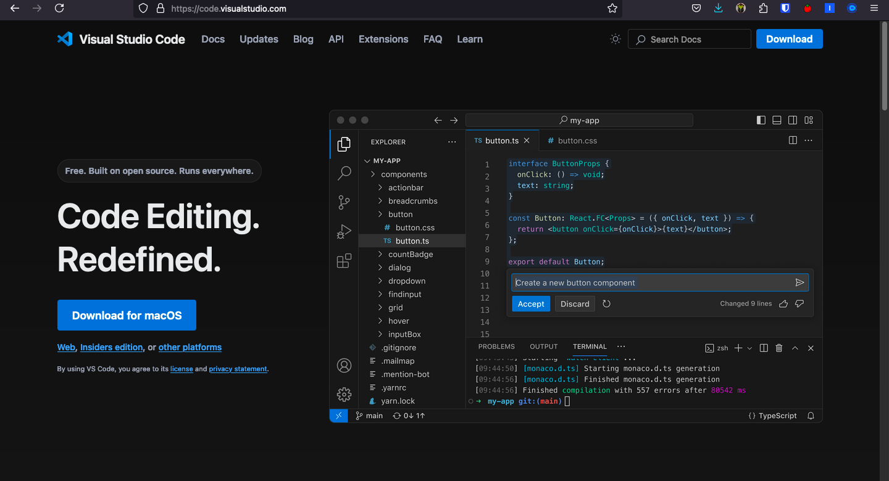
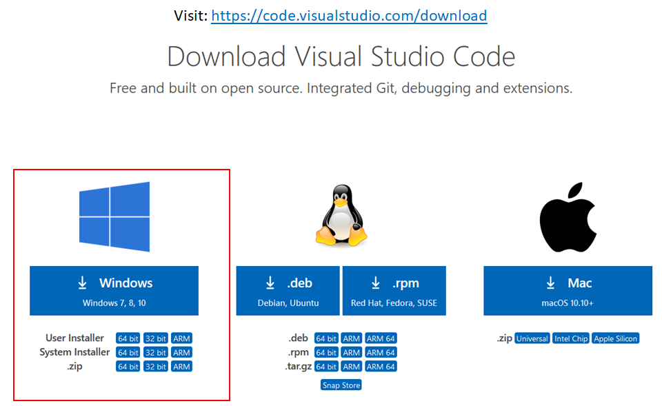
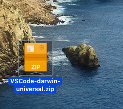
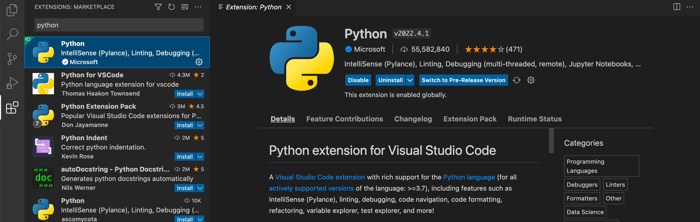
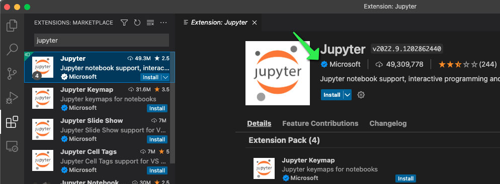
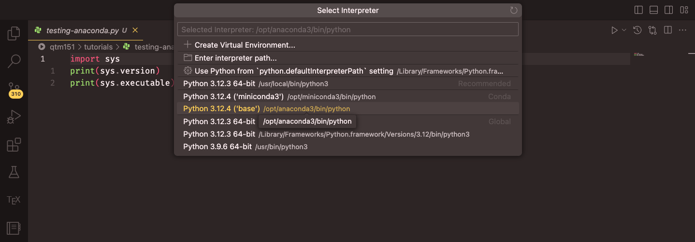
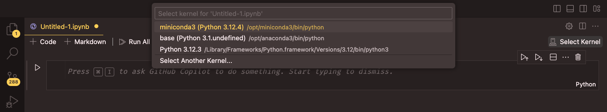
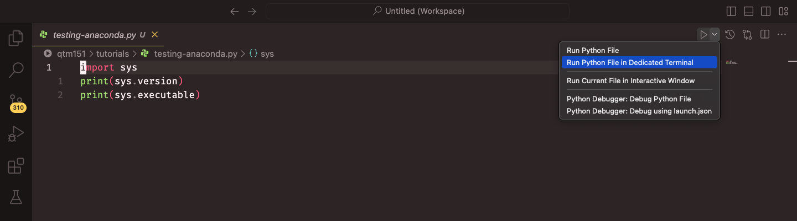
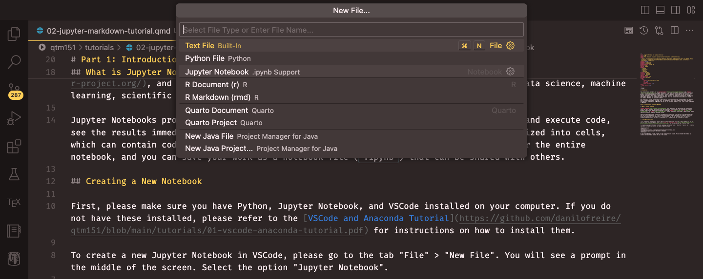

## For Today

#### Requirements

- ✅ A laptop, charged, with administrator rights
- ✅ The Python and VS Code installers downloaded, if possible
- ✅ Functions, loops and conditions

#### Programme

1. Why leave Colab
2. Installing Python and VS Code
3. Virtual environments
4. Scripts, notebooks and projects
5. Files, paths and the four formats
6. Reproducibility and version control

### Any questions?

## Today Is Different

- Very little new Python
- A lot of installing, clicking and troubleshooting
- Things will go wrong on some machines, and that is the point of doing it together

By the end of this lecture, everyone runs Python on their own laptop, in an environment they built themselves. Weeks 7 to 10 assume it.

# 1. Why Leave Colab

## What Colab Gave Us

- Zero installation
- Identical environment for everyone
- Free computing power

## What Colab Costs

- Your files are not really yours: they live in Google Drive, in Google's format
- The runtime disconnects, and everything is lost
- Reading a file from your own computer is awkward
- No project structure: everything is one notebook
- You cannot run a script on a schedule, or hand it to a colleague
- You never learn where packages come from

## The Professional Setup

| | Colab | Local |
|:--|:--|:--|
| Install | none | 30 minutes, once |
| Your data | uploaded each time | on your disk |
| Version control | painful | built in |
| Big files | slow | instant |
| Opening your own file | mount, upload or a URL | `pd.read_csv("data/x.csv")` |
| Package versions | Google decides | you decide |
| Employability | "I used a website" | "I have an environment" |

Colab remains excellent for teaching, quick tests, and sharing. It is not where analysis lives.

## The Reason, In Two Slides

Last week you learned three ways to open a file in Colab. Here is the best of them:

```{python}
#| eval: false
from google.colab import drive
drive.mount("/content/drive")          # and authorise in a pop-up. Every session.

sales = pd.read_csv("/content/drive/MyDrive/BAA1118/data/roasted_daily.csv")
```

- Three lines, one of them interactive
- A path that describes Google's filesystem, not yours
- Your data has to be in Drive
- And it breaks the moment somebody else runs your notebook

## The Reason, In Two Slides

Here is the same thing once Python is on the machine where the file already is:

```{python}
#| eval: false
sales = pd.read_csv("data/roasted_daily.csv")
```

::: {.callout-important}
That is the entire argument for today. Everything else, the environment, the folder
structure, the version control, follows from putting Python **next to your data** instead of
in somebody else's data centre.
:::

Two hours of installation buys you that one line, for every file, for the rest of your career.

# 2. Installing Python and VS Code

## The Two Things to Install

1. **Python** itself, from [python.org](https://www.python.org/downloads/): the language, and `pip` to install packages
2. **VS Code**, from [code.visualstudio.com](https://code.visualstudio.com/): the editor where you will write

That is the whole stack. Two downloads, no bundle, nothing hidden.

## Why Not Anaconda?

Anaconda is a legitimate and very common choice. It installs Python, `conda`, Spyder, JupyterLab and 1,500 packages in one go.

We are not using it, for four reasons:

- You learn nothing about where your packages come from
- 1 GB of packages you will never open, and a slow `conda` resolver
- Its commercial licence now restricts use in larger organisations, so your employer may not allow it
- `pip` and `venv` are what every Python project on GitHub actually uses

## If You Already Have Anaconda

Keep it. You do not have to uninstall anything. Everything today has a `conda` equivalent:

| This module | Anaconda equivalent |
|:--|:--|
| `python -m venv .venv` | `conda create --name baa1118 python=3.12` |
| `source .venv/bin/activate` | `conda activate baa1118` |
| `pip install pandas` | `conda install pandas` |
| `pip freeze > requirements.txt` | `conda env export > environment.yml` |

Mixing the two in one environment causes strange breakages. **Pick one per project and stay with it.**

## Installing Python

1. Go to [python.org/downloads](https://www.python.org/downloads/)
2. Take **Python 3.12 or 3.13**, not the newest release: some packages take months to catch up
3. Run the installer

::: {.callout-important}
**Windows: tick "Add python.exe to PATH" on the first screen.** That single unticked checkbox is the cause of most week-6 problems in every university on earth.

**macOS**: after installing, double-click `Install Certificates.command` in the Python folder in Applications, or downloading files will fail later.
:::

## Checking Python Installed

Open a terminal: **PowerShell** on Windows, **Terminal** on macOS.

```{.bash filename="Terminal"}
python --version        # Windows
python3 --version       # macOS and Linux
```

You should see `Python 3.12.x` or `3.13.x`.

- On Windows the command is `python`, and `py` also works
- On macOS and Linux it is `python3`: plain `python` may not exist at all
- These slides write `python`. Type `python3` if that is your machine.

## macOS: Do Not Use the System Python

macOS ships with its own Python at `/usr/bin/python3`. It belongs to Apple, and it is there for the operating system.

```{.bash filename="Terminal"}
which python3
```

If that prints `/usr/bin/python3`, you are using Apple's. Installing packages into it can break system tools and will be wiped by the next macOS update.

The virtual environment we build in the next section makes this problem disappear, which is one more reason to build one.

## Installing VS Code

{width="65%" fig-align="center"}

::: {.small-font}
Source: Danilo Freire, [DATASCI 151 course tutorials](https://github.com/danilofreire/datasci151)
:::

## Installing VS Code

:::: {layout="[1,1]"}
::: {#first-column}
### Windows


:::

::: {#second-column}
### macOS


:::
::::

::: {.small-font}
On Windows, tick "Add to PATH" when offered. On macOS, drag the app into Applications. Source: Danilo Freire, DATASCI 151.
:::

## The Three Extensions

Open VS Code, click the **Extensions** icon in the left bar (four squares), and install:

- **Python** (Microsoft): interpreter selection, linting, running files
- **Jupyter** (Microsoft): notebooks inside VS Code
- **Ruff** (Astral): fast formatting and error checking as you type

Restart VS Code once they are installed.

## The Two That Matter Most

:::: {layout="[1,1]"}
::: {#first-column}

:::

::: {#second-column}

:::
::::

::: {.small-font}
Source: Danilo Freire, [DATASCI 151 course tutorials](https://github.com/danilofreire/datasci151)
:::

## Your Turn: Install and Verify {background="#43464B"}

1. Install Python from python.org, ticking **Add python.exe to PATH** on Windows
2. Install VS Code, then the Python, Jupyter and Ruff extensions
3. Open a terminal and run `python --version` (or `python3 --version`)
4. Run `python -m pip --version`. Does it point at the Python you just installed?
5. **Help your neighbour.** Nobody moves on alone.

::: {#timer1 .timer seconds="840" starton="interaction"}
:::

## When It Does Not Work

| Symptom | Usual cause |
|:--|:--|
| `python: command not found` | PATH checkbox missed, or terminal not restarted |
| `python` opens the Microsoft Store | Windows alias; use `py` or reinstall with PATH |
| Version says 2.7 or 3.9 on macOS | you are on Apple's system Python |
| `pip: command not found` | use `python -m pip` instead |
| Installer will not run | not an administrator, or a locked work machine |

The last one is not solvable in a lecture. If your machine is locked down, stay on Colab and see me afterwards.

# 3. Virtual Environments

## The Problem

You install `pandas` for this module. In March you install an older `pandas` for a group project. Now this module's notebooks break.

- One Python installation has **one** set of packages
- Two projects needing different versions cannot both work
- Installing something for a tutorial can silently break work from last month
- And you have no record of what any project actually needs

## The Solution

A **virtual environment** is a private set of packages for one project.

{width="65%" fig-align="center"}

::: {.small-font}
Source: Neuroinformatics Unit, UCL, [Introduction to Python](https://neuroinformatics.dev/course-intro-python)
:::

## What It Actually Is

No magic. It is **a folder**.

```{.bash}
BAA1118/
└── .venv/
    ├── bin/            (Scripts/ on Windows)
    │   ├── python      <- a link to your real Python
    │   └── pip
    └── lib/
        └── python3.12/
            └── site-packages/   <- your packages live here
```

- Created in seconds, deleted by deleting the folder
- Nothing else on your machine is touched
- If it ever gets confusing: delete it, make a new one, reinstall. That is a normal thing to do.

## Creating One

In your project folder, in a terminal:

```{.bash filename="Terminal"}
cd path/to/BAA1118
python -m venv .venv
```

- `python -m venv` runs the `venv` module of the Python you just named
- `.venv` is the folder name, and it is a **strong convention**: VS Code looks for it, and everyone recognises it
- The leading dot hides it from your file browser

Do this **once per project**, not once per machine.

## Activating It

The environment exists, but your terminal is not using it yet.

```{.bash filename="macOS / Linux"}
source .venv/bin/activate
```

```{.bash filename="Windows PowerShell"}
.venv\Scripts\Activate.ps1
```

```{.bash filename="Windows CMD"}
.venv\Scripts\activate.bat
```

Your prompt changes:

```{.bash filename="macOS / Linux"}
(.venv) damien@laptop BAA1118 %
```

```{.bash filename="Windows PowerShell"}
(.venv) PS C:\Users\damien\BAA1118>
```

**That `(.venv)` is the whole point.** No `(.venv)`, no environment.

## Windows Will Refuse the First Time

```{.bash filename="PowerShell"}
.venv\Scripts\Activate.ps1
# ... cannot be loaded because running scripts is disabled on this system
```

Run this once, then activate again:

```{.bash filename="PowerShell"}
Set-ExecutionPolicy -Scope CurrentUser -ExecutionPolicy RemoteSigned
```

To leave an environment, from anywhere:

```{.bash filename="Terminal"}
deactivate
```

## Installing Into It

With `(.venv)` showing:

```{.bash filename="Terminal"}
python -m pip install --upgrade pip
python -m pip install pandas matplotlib seaborn statsmodels scikit-learn jupyter ipykernel
```

- `python -m pip` rather than bare `pip`: it installs into **the interpreter you just named**, never into some other one you forgot about
- `ipykernel` is what lets a notebook use this environment. Forget it and your notebook silently runs the wrong Python.

## Where Did That Actually Go?

The single most useful debugging command in Python:

```{.bash filename="Terminal"}
python -c "import sys; print(sys.executable)"
```

```{.bash}
/Users/damien/BAA1118/.venv/bin/python      <- correct
/usr/bin/python3                            <- system Python, wrong
/opt/anaconda3/bin/python                   <- Anaconda, wrong for this project
```

```{.bash filename="Terminal"}
python -m pip list          # what is installed here
which python                # macOS/Linux
where python                # Windows
```

## Telling VS Code

VS Code has to be pointed at the environment **twice**: once for scripts, once for notebooks.

1. <kbd>Ctrl</kbd>/<kbd>Cmd</kbd> + <kbd>Shift</kbd> + <kbd>P</kbd>, then `Python: Select Interpreter`
2. Choose the one showing `.venv` and `('.venv': venv)`

{width="70%" fig-align="center"}

::: {.small-font}
Source: Danilo Freire, [DATASCI 151 course tutorials](https://github.com/danilofreire/datasci151)
:::

## Telling VS Code, Part Two

In a notebook, top right: **Select Kernel**, then the same `.venv`.

{width="70%" fig-align="center"}

::: {.small-font}
Source: Danilo Freire, [DATASCI 151 course tutorials](https://github.com/danilofreire/datasci151)
:::

The interpreter and the kernel are **two separate settings**. This surprises everyone once.

## The Three Symptoms of a Wrong Environment

1. **`ModuleNotFoundError` for something you just installed.** You installed into a different Python than the one running your code.
2. **It works in the terminal but not in the notebook.** The kernel is not your `.venv`, or `ipykernel` is missing from it.
3. **`pip` puts things somewhere unexpected.** Bare `pip` may belong to another installation.

All three have the same diagnosis, and it takes five seconds:

```{.python}
import sys
print(sys.executable)
```

Run it in the notebook. If that path does not contain `.venv`, you have found your bug.

## Recording What You Used

```{.bash filename="Terminal"}
python -m pip freeze > requirements.txt
```

```{.bash filename="requirements.txt"}
matplotlib==3.9.2
pandas==2.2.3
scikit-learn==1.5.2
seaborn==0.13.2
statsmodels==0.14.4
```

Anyone, on any machine, can now rebuild your environment exactly:

```{.bash filename="Terminal"}
python -m venv .venv
source .venv/bin/activate
python -m pip install -r requirements.txt
```

## Pinning, Loosely or Exactly

```{.bash}
pandas                # any version: convenient, not reproducible
pandas>=2.2           # at least this: reasonable for a library
pandas==2.2.3         # exactly this: what an analysis should use
```

::: {.callout-important}
An analysis whose results depend on the package version and does not record it is not reproducible. `pip freeze` is one command, and it is the difference between "it worked in September" and "here is exactly what I ran".
:::

Commit `requirements.txt`. Never commit `.venv/`.

## One Project, One Environment

- One folder per project
- One `.venv` inside it
- One `requirements.txt` beside it
- Activate when you start work, `deactivate` when you finish

If you only remember one slide from today, this is it.

## Two Alternatives Worth Knowing By Name

- **conda / miniforge**: manages non-Python dependencies too (GDAL, CUDA, R). Worth it for geospatial work or deep learning, overkill here.
- **uv**: a much faster drop-in replacement for `pip` and `venv`, written in Rust, spreading quickly through industry. `uv venv`, `uv pip install`. Same concepts, ten times the speed.

The **ideas** you learn today transfer to all of them: an isolated set of packages, a record of what is in it, and knowing which Python is running.

## Your Turn: Build Your Environment {background="#43464B"}

1. Create a folder `BAA1118` and open it in VS Code with `File -> Open Folder`
2. In VS Code's terminal, create and activate `.venv`. Confirm you see `(.venv)`.
3. Install `pandas`, `matplotlib`, `seaborn`, `statsmodels`, `scikit-learn`, `jupyter` and `ipykernel`
4. Run `python -c "import sys; print(sys.executable)"`. Does the path contain `.venv`?
5. Select the interpreter in VS Code, then create `test.py` with `import pandas as pd; print(pd.__version__)` and run it
6. Freeze a `requirements.txt`

::: {#timer2 .timer seconds="1140" starton="interaction"}
:::

## Solution

```{.bash filename="Terminal"}
python -m venv .venv
source .venv/bin/activate                 # or .venv\Scripts\Activate.ps1
python -m pip install --upgrade pip
python -m pip install pandas matplotlib seaborn statsmodels scikit-learn jupyter ipykernel
python -c "import sys; print(sys.executable)"
python -m pip freeze > requirements.txt
```

If step 5 gives `ModuleNotFoundError: pandas` while the terminal install clearly worked, VS Code is running a different interpreter. Reselect it, and check `sys.executable` from inside the file.

# 4. Scripts, Notebooks and Projects

## .py vs .ipynb

:::: {layout="[1,1]"}
::: {#first-column}
### `.py` script

Plain text, only code. Runs from top to bottom, every time, in order.

Good for: reusable tools, automation, anything another program will run.
:::

::: {#second-column}
### `.ipynb` notebook

Code, text and output together, run cell by cell.

Good for: exploration, analysis, teaching, reports.
:::
::::

For this module: **notebooks for analysis, scripts for functions you reuse**.

## Running a Script

{width="70%" fig-align="center"}

::: {.small-font}
Source: Danilo Freire, [DATASCI 151 course tutorials](https://github.com/danilofreire/datasci151)
:::

From a terminal, which is what a server or a colleague will do. Open one inside VS Code with
`View -> Terminal`, or <kbd>Ctrl</kbd>+<kbd>`</kbd> on **both** Windows and Mac:

```{.bash filename="Terminal"}
cd path/to/your/folder
python test.py
```

::: {.small-font}
`cd` changes directory, `cd ..` goes up one. `dir` lists files on Windows, `ls` on macOS and
Linux. On Windows the file is run with `python test.py`, on macOS with `python3 test.py`
unless your `.venv` is active, in which case `python` is correct on both.
:::

## Notebooks in VS Code

{width="70%" fig-align="center"}

::: {.small-font}
`File -> New File -> Jupyter Notebook`, then **Select Kernel** and choose your `.venv`. Source: Danilo Freire, DATASCI 151.
:::

## Notebook Shortcuts

| Action | Windows / Linux | Mac |
|:--|:--|:--|
| Run cell, move on | <kbd>Shift</kbd>+<kbd>Enter</kbd> | <kbd>Shift</kbd>+<kbd>Enter</kbd> |
| Run cell, stay | <kbd>Ctrl</kbd>+<kbd>Enter</kbd> | <kbd>Cmd</kbd>+<kbd>Enter</kbd> |
| Insert above / below | <kbd>Esc</kbd> then <kbd>A</kbd> / <kbd>B</kbd> | <kbd>Esc</kbd> then <kbd>A</kbd> / <kbd>B</kbd> |
| Turn cell into text | <kbd>Esc</kbd> then <kbd>M</kbd> | <kbd>Esc</kbd> then <kbd>M</kbd> |
| Delete cell | <kbd>Esc</kbd> then <kbd>D</kbd> <kbd>D</kbd> | <kbd>Esc</kbd> then <kbd>D</kbd> <kbd>D</kbd> |

::: {.callout-note}
**Not quite the same as Colab.** Running cells is identical, but Colab puts its cell
commands behind <kbd>Ctrl</kbd>/<kbd>Cmd</kbd>+<kbd>M</kbd>, while VS Code uses
<kbd>Esc</kbd> to leave the cell first. Same idea, one key different.
:::

## VS Code Shortcuts Worth Knowing

| Action | Windows / Linux | Mac |
|:--|:--|:--|
| Command palette | <kbd>Ctrl</kbd>+<kbd>Shift</kbd>+<kbd>P</kbd> | <kbd>Cmd</kbd>+<kbd>Shift</kbd>+<kbd>P</kbd> |
| Open / close terminal | <kbd>Ctrl</kbd>+<kbd>`</kbd> | <kbd>Ctrl</kbd>+<kbd>`</kbd> |
| Open a folder | <kbd>Ctrl</kbd>+<kbd>K</kbd> <kbd>Ctrl</kbd>+<kbd>O</kbd> | <kbd>Cmd</kbd>+<kbd>O</kbd> |
| Save | <kbd>Ctrl</kbd>+<kbd>S</kbd> | <kbd>Cmd</kbd>+<kbd>S</kbd> |
| Comment / uncomment | <kbd>Ctrl</kbd>+<kbd>/</kbd> | <kbd>Cmd</kbd>+<kbd>/</kbd> |
| Find in all files | <kbd>Ctrl</kbd>+<kbd>Shift</kbd>+<kbd>F</kbd> | <kbd>Cmd</kbd>+<kbd>Shift</kbd>+<kbd>F</kbd> |

The terminal one is the one to learn today. <kbd>Ctrl</kbd>+<kbd>`</kbd> is the same key on
both, it opens **inside your project folder**, and it is already using your `.venv`.

::: {.small-font}
The full list, with your own bindings, is `File -> Preferences -> Keyboard Shortcuts` on
Windows and `Code -> Settings -> Keyboard Shortcuts` on macOS.
:::

## Project Structure

One folder per project. Inside it, always the same layout:

```{.bash}
BAA1118/
├── .venv/              <- never committed, never edited
├── data/
│   ├── raw/            <- never edited, ever
│   └── clean/          <- produced by your code
├── notebooks/
│   └── analysis.ipynb
├── src/
│   └── functions.py
├── output/
│   ├── figures/
│   └── tables/
├── requirements.txt
└── README.md
```

This is not bureaucracy. It is what makes an analysis findable in a year.

## The Golden Rule of Raw Data

::: {.callout-important}
**Never edit a raw data file.** Not in Excel, not by hand, not "just this once".

Read it, transform it in code, write the result to `data/clean/`. If the transformation is wrong, you fix a line and rerun. If you edited the original, it is gone.
:::

## Your Turn: A Script and a Notebook {background="#43464B"}

With your `.venv` active:

1. Create `src/functions.py` containing your `margin(revenue, cost)` function from week 5, with its docstring
2. At the bottom add `print(margin(1000, 620))`, then run the file
3. Run it again from the terminal with `python src/functions.py`
4. Create `notebooks/week6.ipynb`, select your `.venv` as the kernel, and run:

```{.python}
import sys
sys.path.append("../src")
from functions import margin
margin(1000, 620)
```

5. Why did the `print()` line also run when you imported?

::: {#timer3 .timer seconds="660" starton="interaction"}
:::

## Solution

Importing a module **runs the whole file**, including the `print()` at the bottom. That is why reusable code puts its test calls behind a guard:

```{.python}
def margin(revenue, cost):
    """Return the profit margin as a percentage, to 1 decimal."""
    return round((revenue - cost) / revenue * 100, 1)

if __name__ == "__main__":
    print(margin(1000, 620))
```

- Run the file directly: the guard is true, the test prints
- Import it from a notebook: the guard is false, only the function arrives

You will see `if __name__ == "__main__":` in every Python repository you ever open. That is what it is for.

# 5. Files, Paths and the Four Formats

## Anatomy of a Path

```{.default filename="macOS and Linux"}
/Users/damien/Documents/BAA1118/data/raw/roasted_daily.csv
```

```{.default filename="Windows"}
C:\Users\damien\Documents\BAA1118\data\raw\roasted_daily.csv
```

- **Root**: `/` on macOS and Linux, `C:\` on Windows. Windows has one root per drive.
- **Folders**, separated by `/` or `\`
- **File name**, and its **extension**, which is part of the name
- Absolute paths start at the root. Relative paths start wherever Python is standing.

## Where Am I Standing?

```{python}
#| eval: false
import os
print(os.getcwd())      # the current working directory
print(os.listdir())     # what is in it
```

Every relative path is resolved **from that directory**. It is not where the file you are
editing lives, and it is not where you opened VS Code from last week: it is one specific
folder, and Python will tell you which.

::: {.callout-important}
When a path fails, print `os.getcwd()` before you change anything else. Nine times out of
ten the path is fine and you are standing somewhere unexpected.
:::

## The Notebook-in-a-Subfolder Trap

Your project has the layout from the last section:

```{.default}
BAA1118/
├── data/raw/roasted_daily.csv
└── notebooks/analysis.ipynb        <- you are working here
```

In VS Code, a notebook's working directory is **its own folder**, so from
`notebooks/analysis.ipynb`:

```{python}
#| eval: false
pd.read_csv("data/raw/roasted_daily.csv")      # FileNotFoundError
pd.read_csv("../data/raw/roasted_daily.csv")   # works
```

`..` means "the folder above this one". `.` means "this one". Every project with a
`notebooks/` folder runs into this in its first hour.

## Absolute vs Relative

```{python}
#| eval: false
# absolute: works on my machine, and nowhere else
"/Users/damien/Documents/BAA1118/data/raw/sales.csv"
"C:/Users/damien/Documents/BAA1118/data/raw/sales.csv"

# relative: works on any machine, from the project folder
"data/raw/sales.csv"
"../data/raw/sales.csv"
```

::: {.callout-warning}
An absolute path in submitted code is an automatic problem: it cannot run on my machine, so
it cannot be marked. **Always use relative paths**, and open the project folder rather than
the file so that "relative to what" has an answer.
:::

## The Windows Backslash Problem

```{python}
#| eval: false
"data\raw\sales.csv"      # broken: \r and \s are escape characters
"data/raw/sales.csv"      # fine, on every operating system
r"data\raw\sales.csv"     # fine, r means "raw string"
```

Python reads `\r` as a carriage return and `\t` as a tab, so the folder names disappear
before pandas ever sees them.

Forward slashes work on Windows too. Use them everywhere and the problem stops existing.

## Do Not Type Paths. Copy Them.

Every operating system will give you a path, and VS Code will give you the **relative** one,
which is the one you want.

| Where | How |
|:--|:--|
| **VS Code** | right-click the file in the Explorer → **Copy Relative Path** |
| macOS Finder | right-click, hold <kbd>Option</kbd> → **Copy … as Pathname** |
| Windows Explorer | <kbd>Shift</kbd> + right-click → **Copy as path** |

::: {.callout-tip}
Windows wraps its copied path in quotes and uses backslashes, so you will still have to
tidy it. VS Code's "Copy Relative Path" needs no tidying at all, which is why it is the one
to learn.
:::

## Windows Hides Your Extensions

You save `sales.csv` from Excel. Your folder shows `sales`. Python cannot find `sales.csv`,
and `sales` is not a file it can read either.

The file is really called `sales.csv.txt`, or the extension is simply not being displayed.

**Fix it once, permanently:** in File Explorer, `View` → `Show` → tick **File name
extensions**.

Every Windows user in this room should do that now. It prevents an entire category of
wasted afternoon.

**macOS hides them too**, just more quietly: Finder, `Settings...` -> `Advanced` -> tick
**Show all filename extensions**. Do it for the same reason.

## Debugging a Path in Four Steps

```{python}
#| eval: false
import os
from pathlib import Path

print(os.getcwd())                          # 1. where am I?
print(sorted(os.listdir("data/raw")))       # 2. is the file there, spelled that way?
print(Path("data/raw/sales.csv").exists())  # 3. a straight yes or no
print(Path("data/raw/sales.csv").resolve()) # 4. what did that actually mean?
```

- Step 2 catches the missing extension and the wrong capitalisation
- Step 3 is the fastest question you can ask
- Step 4 turns your relative path into the absolute one, so you can see where Python looked

## pathlib, The Modern Way

```{python}
from pathlib import Path

data_path = Path("data") / "raw" / "roasted_daily.csv"
print(data_path)
print(data_path.suffix)
print(data_path.stem)
print(data_path.parent)
```

`Path` joins with `/` regardless of the operating system, and gives you useful methods:

```{python}
#| eval: false
data_path.exists()
data_path.resolve()
Path("output/figures").mkdir(parents=True, exist_ok=True)
list(Path("data/raw").glob("*.csv"))
```

## One Path, Defined Once

The pattern worth adopting for your project:

```{python}
#| eval: false
from pathlib import Path

RAW = Path("data/raw")
CLEAN = Path("data/clean")
OUTPUT = Path("output")

daily = pd.read_csv(RAW / "roasted_daily.csv")
stores = pd.read_csv(RAW / "roasted_stores.csv")

daily.to_parquet(CLEAN / "daily.parquet", index=False)
fig.savefig(OUTPUT / "figures" / "revenue.png", dpi=300)
```

Three names at the top of the notebook, and the folder structure appears in exactly one
place. Move the project, or restructure it, and you edit three lines rather than thirty.

## Never Do This

```{python}
#| eval: false
os.chdir("/Users/damien/Documents/BAA1118")     # no
```

- It hard-codes your machine into the notebook
- It changes the meaning of every relative path **after** the line it appears on
- So the notebook works on the second run and fails on the first, or the reverse

If your paths need `os.chdir()` to work, the real fix is to open the project folder in VS
Code and use relative paths from there.

## Reading and Writing Text Files

```{python}
#| eval: false
# writing
with open("output/report.txt", "w") as f:
    f.write("Total revenue: 4416.60\n")

# reading
with open("output/report.txt") as f:
    content = f.read()
print(content)
```

- `with` closes the file automatically, even if an error occurs
- `"w"` overwrites, `"a"` appends, no letter means read

For CSV files, do **not** do this. `pd.read_csv()` does it properly, and that is next.

## The Four Formats, Locally

```{python}
#| eval: false
import pandas as pd

stores = pd.read_csv("data/raw/roasted_stores.csv")
daily  = pd.read_parquet("data/raw/roasted_daily.parquet")
orders = pd.read_json("data/raw/orders.json")
report = pd.read_excel("data/raw/quarterly.xlsx", sheet_name="Q1")
```

- Same four functions as last week
- **Relative paths**, from the project folder you opened
- No mounting, no uploading, no pop-up, no `/content/drive/MyDrive/`
- And it works identically on my machine when I mark it

## Two Packages You Now Have to Install

Colab had them. Your `.venv` does not.

```{.bash filename="Terminal"}
python -m pip install openpyxl pyarrow
python -m pip freeze > requirements.txt
```

```{python}
#| eval: false
pd.read_excel("report.xlsx")
# ImportError: Missing optional dependency 'openpyxl'.
#              Use pip or conda to install openpyxl.
```

Read that error properly: pandas is telling you the exact package name to install. This is
what "install once per environment, import once per session" looks like when you get it wrong.

## The Same Table, Four Ways

```{python}
#| echo: false
import os
import pandas as pd

sizes = {ext: os.path.getsize(f"data/roasted_daily.{ext}") / 1024
         for ext in ["csv", "json", "xlsx", "parquet"]}

print(f"{'format':10s} {'size':>10s}   {'vs CSV':>7s}")
for ext, kb in sizes.items():
    print(f"{ext:10s} {kb:8.1f} KB   {kb / sizes['csv']:6.0%}")
```

1,086 rows of Roasted daily sales, saved four times. Parquet is a third of the CSV, and the
JSON is three times bigger because it repeats every column name on every row.

## What CSV Loses

```{python}
#| echo: false
from_csv = pd.read_csv("data/roasted_daily.csv")
from_parquet = pd.read_parquet("data/roasted_daily.parquet")

print("read from CSV:")
print(from_csv[["date", "store"]].dtypes.to_string())
print()
print("read from parquet:")
print(from_parquet[["date", "store"]].dtypes.to_string())
```

- The CSV gives you **text**, because a CSV has no types to give
- The parquet file remembers that `date` was a date and `store` was a category
- Which means no `pd.to_datetime()`, no `astype("category")`, and no chance of forgetting

## Writing Files Out

Every reader has a writer:

```{python}
#| eval: false
clean.to_csv("data/clean/roasted_clean.csv", index=False)
clean.to_parquet("data/clean/roasted_clean.parquet", index=False)
clean.to_excel("output/tables/for_the_board.xlsx", index=False)
clean.to_json("data/clean/roasted_clean.json", orient="records")
```

::: {.callout-warning}
`index=False` on the CSV and Excel writers. Without it, pandas writes the row numbers as an
extra unnamed column, and reading the file back gives you a column called `Unnamed: 0`.
Save and reload three times and you have three of them.
:::

## Which Format For Which Job

| Job | Format |
|:--|:--|
| The raw file you were given | whatever it came as, **never edited** |
| Your cleaned table, for your own next step | `.parquet` |
| A table for a colleague who uses Excel | `.xlsx` |
| A table for anyone, anywhere, forever | `.csv` |
| Something with nested records | `.json` |

For this module: read whatever arrives, save your cleaned data as **parquet**, and export
**csv or xlsx** only when a human is going to open it.

## Your Turn: Build the Project {background="#43464B"}

In your `BAA1118` folder:

1. Create the folders `data/raw`, `data/clean`, `notebooks`, `output/figures`, `src`
2. Download the gapminder file into `data/raw` from
   <https://raw.githubusercontent.com/damien-dupre/data/refs/heads/master/gapminder.csv>
3. In `notebooks/week6.ipynb`, print the working directory and the list of files in `data/raw`
4. Install `openpyxl` and `pyarrow`, then read the CSV and write it back out as
   `data/clean/gapminder.parquet` and `output/tables/gapminder.xlsx`
5. Compare the three file sizes with `os.path.getsize()`, and check that the parquet round-trip
   preserved the column types
6. Write a `README.md` saying, in three lines, what this project is
7. Create a `.gitignore` containing `.venv/` and `data/raw/`

::: {#timer4 .timer seconds="660" starton="interaction"}
:::

## Solution

```{python}
#| eval: false
import os
from pathlib import Path

print(os.getcwd())
print(list(Path("data/raw").glob("*")))
```

If the notebook is in `notebooks/`, the working directory may be the project root or the notebook folder depending on your settings. Check with `os.getcwd()` before blaming the path.

# 6. Reproducibility and Version Control

## What Makes Work Reproducible

- The **data**, unedited, in `data/raw/`
- The **code**, in scripts and notebooks that run top to bottom
- The **environment**, in `requirements.txt`
- A **README** saying what to run, and in what order

Three of those four you built today. That is what separates an analysis from a folder of files.

## Version Control in One Slide

- **Git** records the state of your project at every point you choose
- **GitHub** stores those records online, and shares them
- Together they replace `analysis_final_v2_REALLY_FINAL.ipynb`

```{.bash filename="Terminal"}
git init
git add .
git commit -m "First working analysis"
```

Full treatment belongs to another module. For BAA1118, know the word and, if you can, put your project on GitHub: it is a portfolio.

## What Not To Commit

Create a file called `.gitignore` in your project root:

```{.bash filename=".gitignore"}
.venv/
data/raw/
*.csv
.ipynb_checkpoints/
__pycache__/
.DS_Store
```

::: {.callout-important}
`.venv/` is thousands of files and megabytes, and it is machine-specific. `requirements.txt` replaces it in 8 lines.

Never put data with personal information on GitHub. A public repository is public forever, including its history.
:::

## What We Have Seen

- Python from python.org, VS Code as the editor, nothing bundled
- Which Python is running: `sys.executable`, and why it matters
- `python -m venv .venv`, activate, `python -m pip install`
- The interpreter **and** the kernel, set separately in VS Code
- The three symptoms of a wrong environment, and their one diagnosis
- `pip freeze > requirements.txt` as the record of your environment
- A project folder, and a path as root plus folders plus a file name
- The working directory, `..` from a subfolder, and why absolute paths cannot be marked
- Copy Relative Path in VS Code, and turning on file extensions in Windows *and* macOS
- The four-step path debug, `pathlib`, and folder constants defined once
- `read_csv`, `read_parquet`, `read_json`, `read_excel` on a relative path, and the writers
  that match them

## Before Next Week

::: {.callout-important}
Everything must be working before week 7. If your machine defeated you today, email me **this week**, not in November.
:::

1. Put `gapminder.csv` in `data/raw/`
2. Activate your environment, open a notebook, run `import pandas as pd`, and confirm no error
3. Check `sys.executable` points at your `.venv`
4. **Assessment 2 opens**, covering weeks 4 to 5

## References

- [Python Packaging: Install packages in a virtual environment using pip and venv](https://packaging.python.org/en/latest/guides/installing-using-pip-and-virtual-environments/)
- [VS Code: Python environments](https://code.visualstudio.com/docs/python/environments)
- Danilo Freire, [Course tutorials: VS Code, Jupyter and GitHub](https://github.com/danilofreire/datasci151), for the setup screenshots
- The Neuroinformatics Unit, [Introduction to Python](https://neuroinformatics.dev/course-intro-python)
- [The Turing Way: Reproducible Research](https://the-turing-way.netlify.app/reproducible-research/reproducible-research)

## {background="#43464B"}

```{=html}
<style>img.circle {border-radius:50%;}</style>
```

::: {layout-ncol="2"}


**Thanks for your attention and don't hesitate to ask if you have any questions!**
[ @damien_dupre](https://datasci.social/@damien_dupre)
[ @damien-dupre](https://github.com/damien-dupre)
[ https://damien-dupre.github.io](https://damien-dupre.github.io)
[ damien.dupre@dcu.ie](mailto:damien.dupre@dcu.ie)
:::
