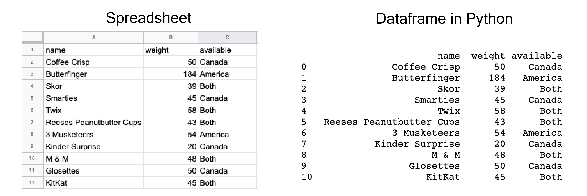
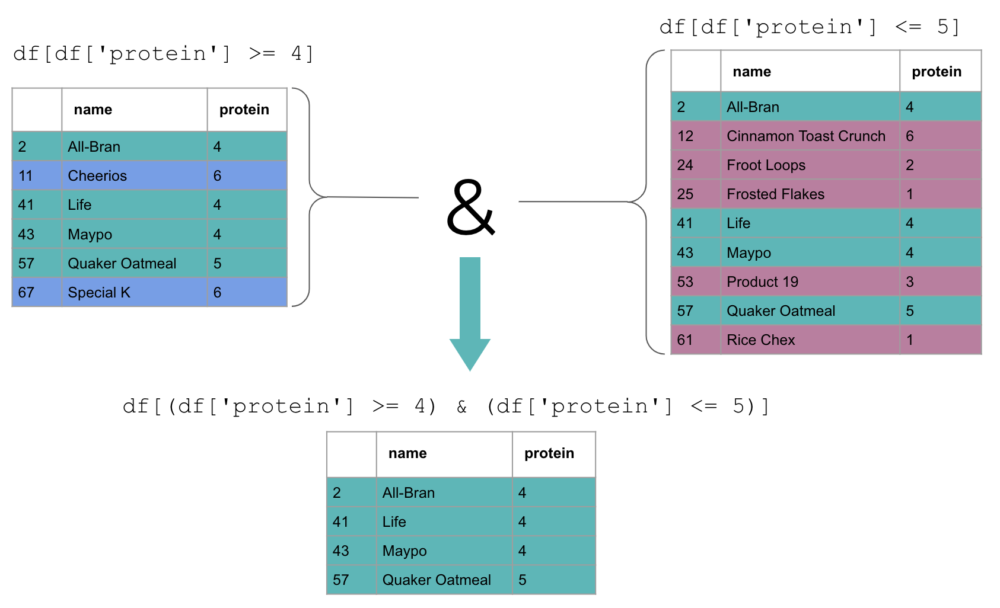
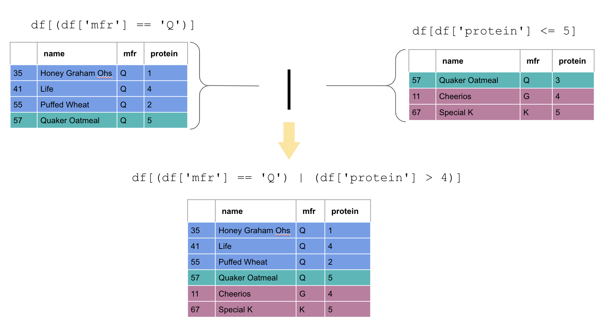

```{python}
#| echo: false
import pandas as pd
pd.set_option("display.max_rows", 8)
pd.set_option("display.width", 100)
```

## For Today

#### Requirements

- ✅ Python running on your own machine
- ✅ A project folder with `data/raw/gapminder.csv`
- ✅ Lists, dictionaries, functions

#### Programme

1. Why pandas
2. Series and DataFrames
3. Reading and inspecting data
4. Selecting and filtering
5. Creating and cleaning columns

### Any questions?

## The Rest of the Module

Weeks 7 to 10 are **one continuous analysis** on the same dataset:

- Week 7: import it, look at it, clean it, filter it
- Week 8: group it, join it, reshape it
- Week 9: visualise it
- Week 10: model it and predict with it

That sequence is the job. Everything before was learning the alphabet.

# 1. Why pandas

## From Lists to Tables

Last week, a table was a list of dictionaries:

```{python}
records = [
    {"country": "Ireland", "year": 2007, "lifeExp": 78.9},
    {"country": "France",  "year": 2007, "lifeExp": 80.7}
]
records
```

Workable for 3 rows. Try computing a mean by continent over 1,700 rows with loops.

## What You Already Know as a Spreadsheet

{width="75%" fig-align="center"}

::: {.small-font}
Source: UBC Master of Data Science, [Programming in Python for Data Science](https://prog-learn.mds.ubc.ca/)
:::

A DataFrame is this, with a type per column and no hidden formulas.

## pandas

**pandas** (from "panel data") is the standard library for tabular data in Python.

- Reads CSV, Excel, JSON, SQL, and 20 other formats
- Operates on **whole columns at once**, no loops
- Handles missing values, dates, text and categories
- About 60% of a data analyst's Python is pandas

```{python}
#| eval: false
import pandas as pd
```

The alias `pd` is universal. Never rename it.

## The Two Objects

:::: {layout="[1,1]"}
::: {#first-column}
### Series

One column. A sequence of values, all the same type, with an index.
:::

::: {#second-column}
### DataFrame

A table. A collection of Series sharing one index.
:::
::::

```{python}
s = pd.Series([78.9, 80.7, 81.7])
print(s)
```

## A Series Is Not a List

```{python}
prices = pd.Series([10.0, 25.0, 8.5])
prices * 1.23
```

No loop, no comprehension. The operation is **vectorised**: applied to every element at once, in fast compiled code.

```{python}
print(prices.mean(), prices.max(), prices.sum())
```

This is the whole point of pandas.

# 2. Reading Data

## The gapminder Dataset

Each row is **a country in a given year**. Six columns:

- `country`: name of the country
- `continent`: one of five continents
- `year`: between 1952 and 2007, every 5 years
- `lifeExp`: life expectancy at birth, in years
- `pop`: population
- `gdpPercap`: GDP per capita, in inflation-adjusted US dollars

It is small, clean, real, and it contains one of the most reliable relationships in economics. We use it for the rest of the module.

## read_csv()

```{python}
url = "https://raw.githubusercontent.com/damien-dupre/data/refs/heads/master/gapminder.csv"
gapminder = pd.read_csv(url)
```

From your own project folder, which is what you should do from now on:

```{python}
#| eval: false
gapminder = pd.read_csv("data/raw/gapminder.csv")
```

Useful arguments when a file misbehaves:

```{python}
#| eval: false
pd.read_csv("file.csv", sep=";")            # European CSVs
pd.read_csv("file.csv", decimal=",")        # comma decimals
pd.read_csv("file.csv", skiprows=3)         # junk header rows
pd.read_csv("file.csv", na_values=["N/A"])  # custom missing markers
```

## Look at It First. Always.

```{python}
gapminder.head()
```

```{python}
gapminder.shape
```

1,704 rows and 6 columns.

## info()

```{python}
gapminder.info()
```

- Column names and their **types**: `object` means text
- Non-null counts: this dataset has no missing values
- Memory use, which matters at a million rows

## describe()

```{python}
gapminder.describe()
```

Numeric columns only, by default. Look for impossible values: a minimum life expectancy of 23 is plausible for 1952 Rwanda; a maximum of 300 would be a data error.

## The Five Lines You Always Run

```{python}
#| eval: false
df.head()             # what does a row look like
df.shape              # how big is it
df.info()             # types and missing values
df.describe()         # ranges and outliers
df["col"].unique()    # what values does this column take
```

::: {.callout-important}
Never analyse a dataset you have not looked at. Half of all analytical errors are a wrong assumption about the data, made in the first five minutes.
:::

## Exploring a Column

```{python}
gapminder["continent"].unique()
```

```{python}
gapminder["continent"].value_counts()
```

```{python}
print(gapminder["year"].min(), gapminder["year"].max(), gapminder["year"].nunique())
```

## Your Turn: First Look {background="#43464B"}

Load gapminder in your own notebook, then answer:

1. How many rows and columns?
2. What is the type of each column?
3. What is the mean life expectancy across the whole dataset?
4. How many distinct countries are there?
5. Which years are covered, and how many rows per year?

::: {#timer1 .timer seconds="420" starton="interaction"}
:::

## Solution

```{python}
print(gapminder.shape)
print(gapminder.dtypes)
print(round(gapminder["lifeExp"].mean(), 2))
print(gapminder["country"].nunique())
print(gapminder["year"].value_counts().sort_index().head(3))
```

# 3. Selecting

## Selecting One Column

```{python}
gapminder["lifeExp"].head()
```

Square brackets and the name in quotes, giving a **Series**.

```{python}
type(gapminder["lifeExp"])
```

## Selecting Several Columns

Double square brackets, because you pass a **list** of names:

```{python}
gapminder[["country", "year", "lifeExp"]].head()
```

```{python}
type(gapminder[["country", "lifeExp"]])
```

::: {.callout-tip}
One bracket gives a Series, two brackets give a DataFrame. It is the single most common source of confusion in week 7.
:::

## loc and iloc

```{python}
gapminder.loc[0:2, ["country", "lifeExp"]]
```

`loc` selects by **label**: row index and column names.

```{python}
gapminder.iloc[0:2, 0:3]
```

`iloc` selects by **position**, and follows the usual "stop excluded" rule.

## Your Turn: Series or DataFrame? {background="#43464B"}

Predict the answer **before** running each line, then check with `type()`:

```{.python}
gapminder["country"]
gapminder[["country"]]
gapminder[["country", "year"]]
gapminder.loc[0, "country"]
gapminder.loc[0:4, "country"]
gapminder.iloc[0]
gapminder.iloc[0:3, 1]
```

Then: select the first 3 rows and the columns `country` and `pop`, first with `loc`, then with `iloc`. Which is more readable?

::: {#timer4 .timer seconds="540" starton="interaction"}
:::

## Solution

```{python}
print(type(gapminder["country"]))
print(type(gapminder[["country"]]))
print(type(gapminder.loc[0, "country"]))
print(type(gapminder.iloc[0]))
```

```{python}
print(gapminder.loc[0:2, ["country", "pop"]])
print(gapminder.iloc[0:3, [0, 4]])
```

::: {.callout-tip}
`loc` needs the names, `iloc` needs you to count columns. Use `loc`: when someone reorders the columns of the source file, `iloc` silently gives you the wrong ones.
:::

Also note `loc[0:2]` returns **3** rows while `iloc[0:3]` returns 3: `loc` includes its endpoint, `iloc` does not.

## Filtering Rows

A comparison on a column gives a Series of booleans:

```{python}
(gapminder["year"] == 2007).head()
```

Put that inside the brackets, and only the `True` rows are kept:

```{python}
gapminder[gapminder["year"] == 2007].head()
```

## Combining Conditions

```{python}
recent_europe = gapminder[(gapminder["year"] == 2007) & (gapminder["continent"] == "Europe")]
recent_europe.head()
```

::: {.callout-warning}
Use `&` for and, `|` for or, `~` for not. The words `and`, `or`, `not` do **not** work on columns.

**Every condition must be in its own brackets.** `df[a == 1 & b == 2]` fails; `df[(a == 1) & (b == 2)]` works.
:::

## What `&` Actually Does



::: {.small-font}
Source: UBC Master of Data Science, [Programming in Python for Data Science](https://prog-learn.mds.ubc.ca/)
:::

## What `|` Actually Does



::: {.small-font}
Source: UBC Master of Data Science, [Programming in Python for Data Science](https://prog-learn.mds.ubc.ca/)
:::

## Useful Filters

```{python}
gapminder[gapminder["country"].isin(["Ireland", "France", "Spain"])].shape
```

```{python}
gapminder[gapminder["country"].str.startswith("Ire")].shape
```

```{python}
gapminder[gapminder["lifeExp"].between(70, 75)].shape
```

## query()

An alternative that some find more readable:

```{python}
gapminder.query("year == 2007 and continent == 'Europe'").head(3)
```

Inside the string, column names are used bare, and the words `and` / `or` work. Note the quote juggling: double outside, single inside.

## Sorting

```{python}
gapminder.query("year == 2007").sort_values("lifeExp", ascending=False).head()
```

```{python}
gapminder.sort_values(["year", "lifeExp"], ascending=[False, False]).head(3)
```

## Your Turn: Selecting and Filtering {background="#43464B"}

1. Select the rows for Ireland only, and print how many there are
2. Print Ireland's life expectancy in 1952 and in 2007
3. Select the countries in Africa in 2007 with a life expectancy above 70
4. Find the five countries with the **lowest** GDP per capita in 2007
5. How many rows have a population above 100 million?

::: {#timer2 .timer seconds="660" starton="interaction"}
:::

## Solution

```{python}
ireland = gapminder[gapminder["country"] == "Ireland"]
print(ireland.shape)
print(ireland[ireland["year"].isin([1952, 2007])][["year", "lifeExp"]])

africa = gapminder[(gapminder["year"] == 2007) &
                   (gapminder["continent"] == "Africa") &
                   (gapminder["lifeExp"] > 70)]
print(africa[["country", "lifeExp"]])
```

## Solution

```{python}
print(gapminder.query("year == 2007").nsmallest(5, "gdpPercap")[["country", "gdpPercap"]])
print((gapminder["pop"] > 100_000_000).sum())
```

Two things worth stealing: `nsmallest()` / `nlargest()`, and `100_000_000` where the underscores are ignored by Python and read by humans.

# 4. Creating and Cleaning Columns

## Creating a Column

```{python}
gapminder["gdp_total"] = gapminder["gdpPercap"] * gapminder["pop"]
gapminder[["country", "year", "gdp_total"]].head(3)
```

The arithmetic is done row by row, automatically. No loop.

```{python}
gapminder["pop_millions"] = (gapminder["pop"] / 1_000_000).round(1)
gapminder[["country", "pop", "pop_millions"]].head(3)
```

## assign() and Chaining

```{python}
(
    gapminder
    .query("year == 2007")
    .assign(gdp_bn = lambda d: d["gdp_total"] / 1e9)
    .sort_values("gdp_bn", ascending=False)
    [["country", "gdp_bn"]]
    .head(3)
)
```

- Each step takes a DataFrame and returns a DataFrame
- Wrapping in `()` lets you put one operation per line
- `lambda d:` means "the table as it is at this point in the chain"

This style is worth learning: it reads top to bottom, like a recipe.

## Renaming

```{python}
gapminder = gapminder.rename(columns={
    "lifeExp": "life_exp",
    "gdpPercap": "gdp_per_cap"
})
gapminder.columns
```

::: {.callout-tip}
Rename to `snake_case` immediately after reading a file. `df["Total Sales (€)"]` will make you miserable for the rest of the project.
:::

## Changing a Type

```{python}
gapminder["year"] = gapminder["year"].astype(int)
gapminder["country"] = gapminder["country"].astype("category")
gapminder.dtypes
```

`category` is worth knowing: for a text column with few distinct values, it uses a fraction of the memory and speeds up grouping.

## Cleaning Text Columns

`.str` gives every string method from lecture 2, applied to the whole column:

```{python}
messy = pd.Series(["  Ireland ", "FRANCE", "spain  "])
messy.str.strip().str.title()
```

```{python}
print(messy.str.strip().str.len().tolist())
print(messy.str.contains("ranc").tolist())
```

## Missing Values

pandas represents missing as `NaN`.

```{python}
demo = pd.DataFrame({
    "country": ["Ireland", "France", "Spain", "Italy"],
    "sales": [120.0, None, 95.0, None]
})
demo
```

```{python}
print(demo["sales"].isna().sum())
print(demo["sales"].mean())     # missing values are skipped
```

## Handling Missing Values

```{python}
print(demo.dropna())            # drop rows with any missing
```

```{python}
print(demo.fillna({"sales": 0}))       # replace with a value
```

::: {.callout-important}
There is no default right answer. Dropping loses information; filling with a mean invents data. **Whatever you choose, say so in your report.**
:::

## Duplicates

```{python}
print(gapminder.duplicated().sum())
print(gapminder.duplicated(subset=["country", "year"]).sum())
```

Zero on both counts, which is what a well-formed dataset looks like: one row per country per year.

```{python}
#| eval: false
df = df.drop_duplicates(subset=["customer_id"], keep="last")
```

## The SettingWithCopyWarning

```{python}
#| eval: false
subset = gapminder[gapminder["year"] == 2007]
subset["new_col"] = 1        # SettingWithCopyWarning
```

pandas is warning you that `subset` may be a view of the original, exactly like the list copy trap from lecture 3.

The fix:

```{python}
#| eval: false
subset = gapminder[gapminder["year"] == 2007].copy()
subset["new_col"] = 1        # fine
```

## Saving Your Work

```{python}
#| eval: false
gapminder.to_csv("data/clean/gapminder_clean.csv", index=False)
```

`index=False` stops pandas writing a useless unnamed first column. Forgetting it is how CSVs grow an extra column every time they are saved.

```{python}
#| eval: false
gapminder.to_excel("output/tables/summary.xlsx", index=False)
```

## Your Turn: Clean and Create {background="#43464B"}

Starting from a fresh read of gapminder:

1. Rename `lifeExp` to `life_exp` and `gdpPercap` to `gdp_per_cap`
2. Create `gdp_total` as GDP per capita times population
3. Create a column `era` equal to `"pre-1980"` or `"post-1980"`, using `np.where` or a comparison
4. Keep only 2007, sort by `life_exp` descending, and show the top 10 countries
5. Save the 2007 subset to `data/clean/gapminder_2007.csv`

::: {#timer3 .timer seconds="660" starton="interaction"}
:::

## Solution

```{python}
import numpy as np

df = pd.read_csv(url).rename(columns={"lifeExp": "life_exp", "gdpPercap": "gdp_per_cap"})
df["gdp_total"] = df["gdp_per_cap"] * df["pop"]
df["era"] = np.where(df["year"] < 1980, "pre-1980", "post-1980")

top10 = df.query("year == 2007").sort_values("life_exp", ascending=False).head(10)
print(top10[["country", "life_exp"]].to_string(index=False))
```

```{python}
#| eval: false
df.query("year == 2007").to_csv("data/clean/gapminder_2007.csv", index=False)
```

## What We Have Seen

- `pd.read_csv()`, then `head`, `shape`, `info`, `describe`
- Series and DataFrame, one bracket versus two
- `loc` by label, `iloc` by position
- Boolean filtering with `&`, `|`, `~`, and every condition in brackets
- Creating columns by arithmetic on whole columns
- `.str` methods, missing values, duplicates
- `to_csv(index=False)`

## Before Next Week

1. **Assessment 3 opens**: clean a small dataset and answer five questions about it
2. Find a dataset for your project. It must have at least 200 rows, one numeric outcome, and two or more plausible predictors.
3. Bring it to next week's lecture.

Good sources: [data.gov.ie](https://data.gov.ie), [CSO](https://data.cso.ie), [Eurostat](https://ec.europa.eu/eurostat/data/database), [Kaggle](https://www.kaggle.com/datasets).

## References

- [pandas: 10 minutes to pandas](https://pandas.pydata.org/docs/user_guide/10min.html)
- Wes McKinney, [Python for Data Analysis](https://wesmckinney.com/book/), free online
- [Real Python: pandas DataFrames](https://realpython.com/pandas-dataframe/)
- UBC Master of Data Science, [Programming in Python for Data Science](https://prog-learn.mds.ubc.ca/), for the diagrams and animations

## {background="#43464B"}

```{=html}
<style>img.circle {border-radius:50%;}</style>
```

::: {layout-ncol="2"}


**Thanks for your attention and don't hesitate to ask if you have any questions!**
[ @damien_dupre](https://datasci.social/@damien_dupre)
[ @damien-dupre](https://github.com/damien-dupre)
[ https://damien-dupre.github.io](https://damien-dupre.github.io)
[ damien.dupre@dcu.ie](mailto:damien.dupre@dcu.ie)
:::
