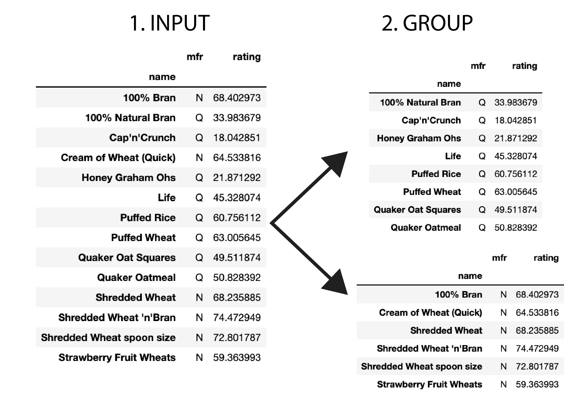
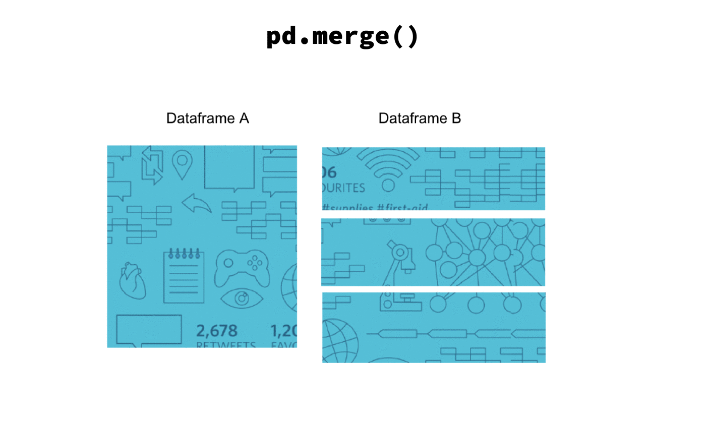
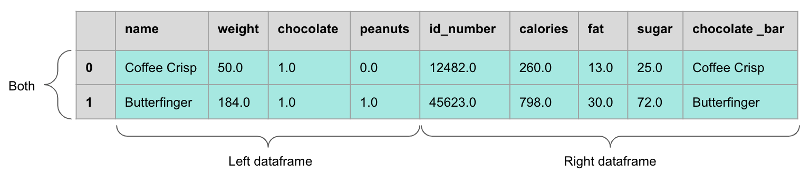
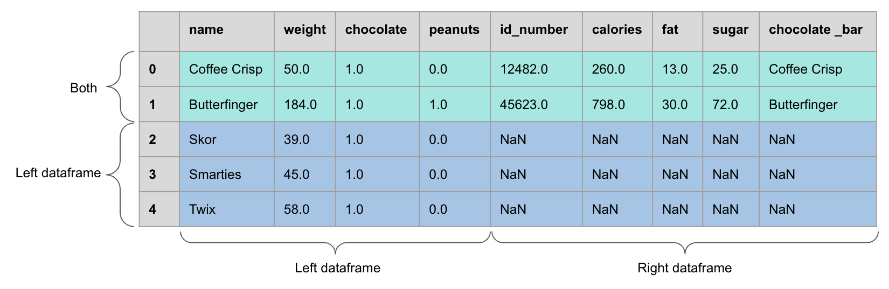
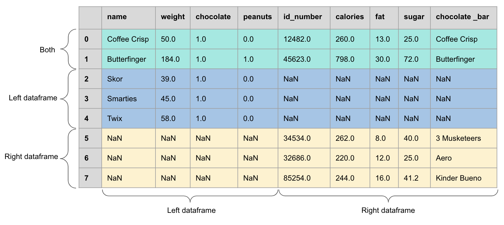
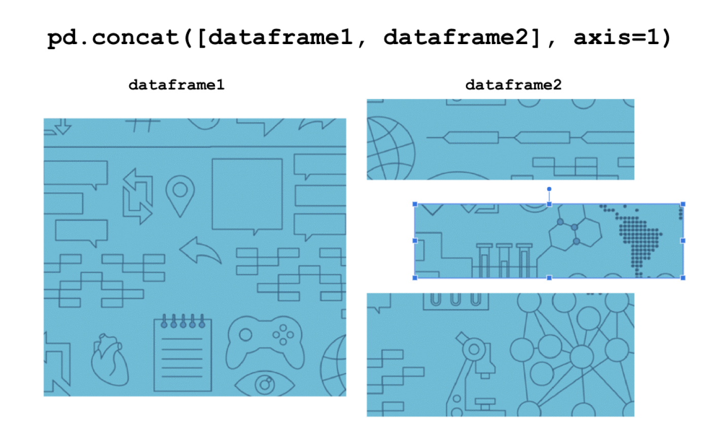
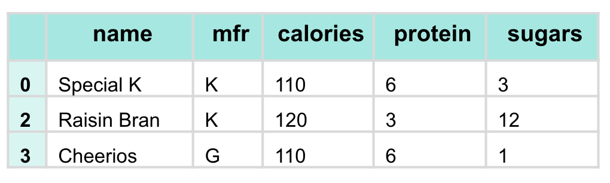
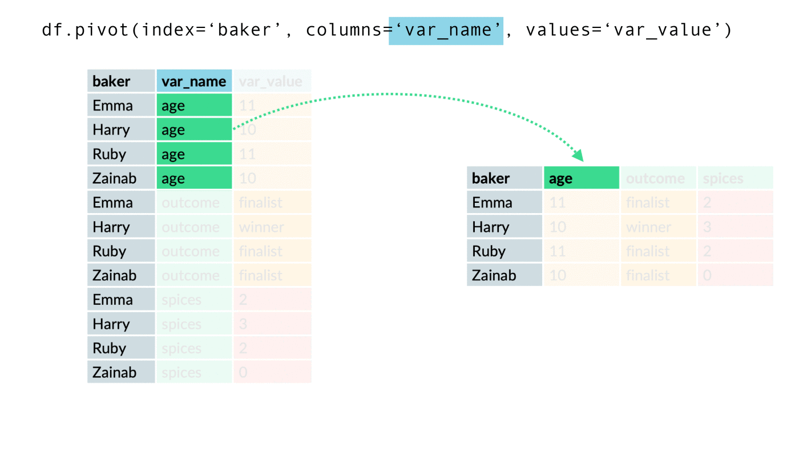
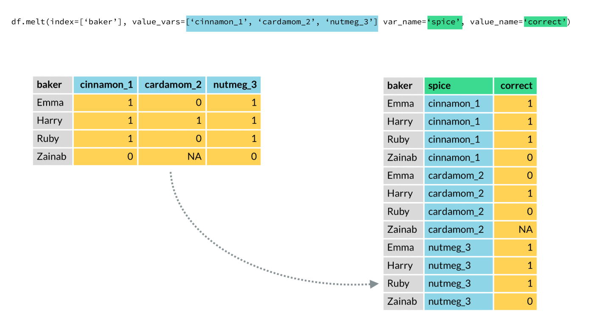

```{python}
#| echo: false
import pandas as pd
pd.set_option("display.max_rows", 8)
pd.set_option("display.width", 100)
url = "https://raw.githubusercontent.com/damien-dupre/data/refs/heads/master/gapminder.csv"
gapminder = pd.read_csv(url).rename(columns={"lifeExp": "life_exp", "gdpPercap": "gdp_per_cap"})
```

## For Today

#### Requirements

- ✅ Reading a CSV, filtering, creating columns
- ✅ A project dataset chosen
- ✅ Assessment 3 in progress

#### Programme

1. Summarising a column
2. `groupby()` and `agg()`
3. Joining tables with `merge()`
4. Reshaping: wide and long
5. Writing a chained pipeline

### Any questions?

## Setup

```{python}
#| eval: true
import pandas as pd

url = "https://raw.githubusercontent.com/damien-dupre/data/refs/heads/master/gapminder.csv"
gapminder = (
    pd.read_csv(url)
    .rename(columns={"lifeExp": "life_exp", "gdpPercap": "gdp_per_cap"})
)
gapminder.head(3)
```

## The Question Behind Everything Today

- Week 7 answered: *what is in this table?*
- Week 8 answers: **what is the answer per group?**

Almost every business question is a grouped one:

> Revenue **per region**. Churn **per segment**. Life expectancy **per continent, per year**.

# 1. Summarising

## Summarising One Column

```{python}
print(gapminder["life_exp"].mean())
print(gapminder["life_exp"].median())
print(gapminder["life_exp"].std())
print(gapminder["life_exp"].min(), gapminder["life_exp"].max())
```

```{python}
gapminder["life_exp"].describe()
```

## Summarising the Whole Table

```{python}
gapminder[["life_exp", "gdp_per_cap", "pop"]].mean()
```

```{python}
gapminder[["life_exp", "gdp_per_cap"]].agg(["mean", "median", "std"]).round(2)
```

`agg()` takes a list of functions and applies each one to each column.

## Counting Categories

```{python}
gapminder["continent"].value_counts()
```

```{python}
gapminder["continent"].value_counts(normalize=True).round(3)
```

`normalize=True` gives proportions, which is almost always what you actually want to report.

## Your Turn: Summarising {background="#43464B"}

Using the whole gapminder table:

1. What are the mean and the median life expectancy? Why are they different?
2. What proportion of the rows are African countries?
3. Produce one table giving the mean, median and standard deviation of `life_exp` and `gdp_per_cap` together
4. What is the highest GDP per capita ever recorded in this dataset, and which country and year was it?

::: {#timer4 .timer seconds="420" starton="interaction"}
:::

## Solution

```{python}
print(gapminder["life_exp"].mean().round(2), gapminder["life_exp"].median())
print(gapminder["continent"].value_counts(normalize=True).round(3)["Africa"])
print(gapminder[["life_exp", "gdp_per_cap"]].agg(["mean", "median", "std"]).round(2))
print(gapminder.nlargest(1, "gdp_per_cap")[["country", "year", "gdp_per_cap"]])
```

The mean sits below the median because the long tail of low life expectancies pulls it down. Kuwait in 1957 is the outlier that will distort every model you fit until you notice it.

# 2. groupby

## Split, Apply, Combine

1. **Split** the table into groups, by the values of a column
2. **Apply** a function to each group
3. **Combine** the results into a new table

Three words that describe `GROUP BY` in SQL, `dplyr::group_by()` in R, and pivot tables in Excel. They are the same idea.

## Split, Apply, Combine

{width="80%" fig-align="center"}

::: {.small-font}
Source: UBC Master of Data Science, [Programming in Python for Data Science](https://prog-learn.mds.ubc.ca/)
:::

`.groupby("mfr")` does the splitting. It computes nothing on its own.

## Your First groupby

```{python}
gapminder.groupby("continent")["life_exp"].mean()
```

Read it in three parts:

- `.groupby("continent")`: split by continent
- `["life_exp"]`: on this column
- `.mean()`: compute this

## The Result Is a Series

```{python}
result = gapminder.groupby("continent")["life_exp"].mean()
print(type(result))
print(result.index)
```

The grouping column has become the **index**. To get an ordinary table back:

```{python}
gapminder.groupby("continent")["life_exp"].mean().reset_index()
```

## Grouping by Several Columns

```{python}
gapminder.groupby(["continent", "year"])["life_exp"].mean().head(6)
```

One row per combination. With 5 continents and 12 years, 60 rows.

```{python}
gapminder.groupby(["continent", "year"])["life_exp"].mean().reset_index().head(3)
```

## Several Statistics at Once

```{python}
gapminder.groupby("continent")["life_exp"].agg(["count", "mean", "std", "max"]).round(2)
```

## Different Statistics per Column

```{python}
gapminder.query("year == 2007").groupby("continent").agg({
    "life_exp": "mean",
    "gdp_per_cap": "median",
    "pop": "sum"
}).round(1)
```

A dictionary: column name to function name. This is how a real summary table is built.

## Named Aggregations

The cleanest form, because you control the output column names:

```{python}
summary = (
    gapminder
    .query("year == 2007")
    .groupby("continent")
    .agg(
        n_countries = ("country", "nunique"),
        mean_life = ("life_exp", "mean"),
        total_pop = ("pop", "sum")
    )
    .round(1)
    .reset_index()
)
summary
```

## Sorting and Filtering Results

```{python}
(
    gapminder
    .query("year == 2007")
    .groupby("continent")["gdp_per_cap"]
    .mean()
    .sort_values(ascending=False)
    .round(0)
)
```

The output of a `groupby` is an ordinary Series or DataFrame. Everything from week 7 still applies to it.

## transform: A Group Value on Every Row

```{python}
gapminder["continent_mean"] = gapminder.groupby("continent")["life_exp"].transform("mean")
gapminder["vs_continent"] = (gapminder["life_exp"] - gapminder["continent_mean"]).round(2)

gapminder.query("year == 2007 and continent == 'Europe'")[
    ["country", "life_exp", "continent_mean", "vs_continent"]
].head(4)
```

`agg` reduces to one row per group. `transform` keeps every row and broadcasts the group value back. This is how you compute "above or below the segment average".

## Your Turn: Grouping {background="#43464B"}

1. Mean life expectancy per continent in 1952, and in 2007. Which continent improved most?
2. For 2007, produce a table with, per continent: number of countries, mean GDP per capita, and total population
3. Which **country** had the largest increase in life expectancy between 1952 and 2007?
4. Add a column giving each country's life expectancy relative to its continent's mean in that year

::: {#timer1 .timer seconds="840" starton="interaction"}
:::

## Solution: 1 and 2

```{python}
both = (
    gapminder.query("year in [1952, 2007]")
    .groupby(["continent", "year"])["life_exp"].mean()
    .unstack()
    .round(1)
)
both["gain"] = (both[2007] - both[1952]).round(1)
print(both)
```

## Solution: 3 and 4

```{python}
change = (
    gapminder.query("year in [1952, 2007]")
    .pivot(index="country", columns="year", values="life_exp")
    .assign(gain = lambda d: d[2007] - d[1952])
    .sort_values("gain", ascending=False)
)
print(change.head(3).round(1))
```

```{python}
gapminder["rel_to_continent"] = (
    gapminder["life_exp"] - gapminder.groupby(["continent", "year"])["life_exp"].transform("mean")
).round(2)
```

# 3. Joining Tables

## Why Join

Real data lives in several tables:

- One table of transactions, one of customers
- One table of measurements, one of country metadata
- One table per year, exported separately

A **join** (or merge) combines them using a shared **key** column.

## Joining, Animated

{width="75%" fig-align="center"}

::: {.small-font}
Source: UBC Master of Data Science, [Programming in Python for Data Science](https://prog-learn.mds.ubc.ca/)
:::

## A Second Table

```{python}
region_info = pd.DataFrame({
    "continent": ["Africa", "Americas", "Asia", "Europe", "Oceania"],
    "hemisphere": ["Both", "Both", "North", "North", "South"],
    "n_un_members": [54, 35, 49, 44, 14]
})
region_info
```

## merge()

```{python}
merged = gapminder.query("year == 2007").merge(region_info, on="continent")
merged[["country", "continent", "hemisphere", "n_un_members"]].head(4)
```

- `on=` names the key column, which must exist in both tables
- Every row of the left table finds its matching row on the right
- The right table's other columns are added

## The Four Kinds of Join

| `how=` | Keeps |
|:--|:--|
| `"inner"` (default) | only keys present in **both** |
| `"left"` | all rows of the left table |
| `"right"` | all rows of the right table |
| `"outer"` | all keys from both |

::: {.callout-tip}
In analysis, `how="left"` is usually right: keep all your observations, add information where it exists. `inner` silently deletes rows, which is how row counts mysteriously drop.
:::

## how="inner"



::: {.small-font}
Only the keys present in both tables survive. Source: UBC Master of Data Science, [Programming in Python for Data Science](https://prog-learn.mds.ubc.ca/)
:::

## how="left"



::: {.small-font}
Every row of the left table is kept; the missing right-hand values become `NaN`. Source: UBC MDS.
:::

## how="outer"



::: {.small-font}
Everything from both tables, with `NaN` wherever a key was missing on one side. Source: UBC MDS.
:::

## Watching a Join Lose Rows

```{python}
partial = region_info[region_info["continent"] != "Africa"]

inner = gapminder.query("year == 2007").merge(partial, on="continent", how="inner")
left = gapminder.query("year == 2007").merge(partial, on="continent", how="left")

print("inner:", inner.shape[0], "rows")
print("left: ", left.shape[0], "rows")
print("missing hemisphere:", left["hemisphere"].isna().sum())
```

**Always compare the row count before and after a join.** It is the cheapest bug-catcher in data analysis.

## Different Key Names

```{python}
lookup = region_info.rename(columns={"continent": "region_name"})

gapminder.query("year == 2007").merge(
    lookup,
    left_on="continent",
    right_on="region_name",
    how="left"
).head(2)
```

## Stacking Instead of Joining

`merge` adds **columns**. `concat` adds **rows**.

```{python}
y1952 = gapminder.query("year == 1952")
y2007 = gapminder.query("year == 2007")

stacked = pd.concat([y1952, y2007], ignore_index=True)
print(y1952.shape, y2007.shape, stacked.shape)
```

This is how you combine twelve monthly export files into one table.

## concat, Animated

{width="75%" fig-align="center"}

::: {.small-font}
Source: UBC Master of Data Science, [Programming in Python for Data Science](https://prog-learn.mds.ubc.ca/)
:::

# 4. Reshaping

## Wide and Long

:::: {layout="[1,1]"}
::: {#first-column}
### Long

One row per observation. `country`, `year`, `life_exp`.

What pandas, seaborn and statistical models want.
:::

::: {#second-column}
### Wide

One row per unit, one column per year.

What humans want to read, and what Excel exports.
:::
::::

You will spend a surprising amount of your career converting between the two.

## Wide and Long

{width="80%" fig-align="center"}

::: {.small-font}
Source: UBC Master of Data Science, [Programming in Python for Data Science](https://prog-learn.mds.ubc.ca/)
:::

## Long to Wide: pivot

```{python}
wide = (
    gapminder
    .query("continent == 'Oceania'")
    .pivot(index="country", columns="year", values="life_exp")
)
wide.iloc[:, :6]
```

- `index`: what stays as rows
- `columns`: what becomes new columns
- `values`: what fills the cells

## pivot, Animated

{width="75%" fig-align="center"}

::: {.small-font}
Source: UBC Master of Data Science, [Programming in Python for Data Science](https://prog-learn.mds.ubc.ca/)
:::

## pivot_table: Pivot With Aggregation

`pivot` fails if there is more than one value per cell. `pivot_table` aggregates instead.

```{python}
(
    gapminder
    .pivot_table(index="continent", columns="year", values="life_exp", aggfunc="mean")
    .iloc[:, :5]
    .round(1)
)
```

This is precisely an Excel pivot table, written in one line and reproducible.

## Wide to Long: melt

```{python}
long = wide.reset_index().melt(
    id_vars="country",
    var_name="year",
    value_name="life_exp"
)
long.head(4)
```

- `id_vars`: the columns to keep as they are
- everything else is unpivoted into two columns: a name and a value

`melt` is what you run immediately after opening a spreadsheet a human designed.

## melt, Animated

{width="75%" fig-align="center"}

::: {.small-font}
Source: UBC Master of Data Science, [Programming in Python for Data Science](https://prog-learn.mds.ubc.ca/)
:::

## Your Turn: Join and Reshape {background="#43464B"}

1. Build a small DataFrame with a `continent` column and a `region_lead` column of your invention
2. Left-join it onto the 2007 gapminder data, and check the row count is unchanged
3. Pivot the European data to get countries as rows and years as columns for `gdp_per_cap`
4. Melt it back to long format and confirm you recover the original number of rows

::: {#timer2 .timer seconds="660" starton="interaction"}
:::

## Solution

```{python}
leads = pd.DataFrame({
    "continent": ["Africa", "Americas", "Asia", "Europe", "Oceania"],
    "region_lead": ["Ama", "Ben", "Chen", "Dana", "Eli"]
})

d2007 = gapminder.query("year == 2007")
joined = d2007.merge(leads, on="continent", how="left")
print(d2007.shape[0], "->", joined.shape[0])

eu_wide = gapminder.query("continent == 'Europe'").pivot(
    index="country", columns="year", values="gdp_per_cap"
)
eu_long = eu_wide.reset_index().melt(id_vars="country", var_name="year", value_name="gdp_per_cap")
print(eu_wide.shape, eu_long.shape)
```

# 5. Chaining

## The Full Pipeline

```{python}
report = (
    pd.read_csv(url)
    .rename(columns={"lifeExp": "life_exp", "gdpPercap": "gdp_per_cap"})
    .query("year == 2007")
    .assign(gdp_bn = lambda d: d["gdp_per_cap"] * d["pop"] / 1e9)
    .groupby("continent")
    .agg(
        n = ("country", "nunique"),
        life_exp = ("life_exp", "mean"),
        gdp_bn = ("gdp_bn", "sum")
    )
    .round(1)
    .sort_values("life_exp", ascending=False)
    .reset_index()
)
report
```

## Why Chain

- No intermediate variables named `df2`, `df3`, `df_final`
- Each line is one verb, readable top to bottom
- Nothing is modified in place, so rerunning a cell is always safe

## Chaining

{width="75%" fig-align="center"}

::: {.small-font}
Source: UBC Master of Data Science, [Programming in Python for Data Science](https://prog-learn.mds.ubc.ca/)
:::

::: {.callout-tip}
Build a chain **one line at a time**, running it after each addition. Never write twelve lines and then hunt for the error.
:::

## Debugging a Chain

```{python}
#| eval: false
(
    gapminder
    .query("year == 2007")
    .pipe(lambda d: print(d.shape) or d)     # peek at the shape mid-chain
    .groupby("continent")["life_exp"].mean()
)
```

Or simply comment out the lines below the one you suspect and run what remains. The chain is still valid code at every step.

## Your Turn: A Full Report {background="#43464B"}

Write **one chain** that produces a table answering:

> For each continent, in 2007: how many countries, mean life expectancy, median GDP per capita, and total population in millions, sorted by mean life expectancy.

Then write a second chain for the same table but for **1952**, and join the two so you can compare.

::: {#timer3 .timer seconds="840" starton="interaction"}
:::

## Solution

```{python}
def continent_report(df, y):
    return (
        df.query("year == @y")
        .groupby("continent")
        .agg(
            n = ("country", "nunique"),
            life_exp = ("life_exp", "mean"),
            gdp_med = ("gdp_per_cap", "median"),
            pop_m = ("pop", lambda s: s.sum() / 1e6)
        )
        .round(1)
        .sort_values("life_exp", ascending=False)
        .reset_index()
    )

r2007 = continent_report(gapminder, 2007)
r1952 = continent_report(gapminder, 1952)

r2007.merge(r1952, on="continent", suffixes=("_2007", "_1952"))[
    ["continent", "life_exp_1952", "life_exp_2007"]
]
```

Note `@y` inside `query()`: it refers to a Python variable rather than a column. And note that the function from week 5 has just saved us writing the chain twice.

## What We Have Seen

- Split, apply, combine: `groupby().agg()`
- Named aggregations for clean output columns
- `transform` to put a group value back on every row
- `merge` for columns, `concat` for rows, and always check the row count
- `pivot` / `pivot_table` and `melt`
- Chained pipelines, built one line at a time

## Before Next Week

1. Apply today's four operations to **your project dataset**: one groupby, one join if you have a second table, one reshape
2. Write down the three most interesting numbers you find. They are the start of your report.
3. Next week we make them visible.

## References

- [pandas: Group by, split-apply-combine](https://pandas.pydata.org/docs/user_guide/groupby.html)
- [pandas: Merge, join and concatenate](https://pandas.pydata.org/docs/user_guide/merging.html)
- Hadley Wickham, [Tidy Data](https://vita.had.co.nz/papers/tidy-data.pdf), the paper behind long format
- UBC Master of Data Science, [Programming in Python for Data Science](https://prog-learn.mds.ubc.ca/), for the diagrams and animations

## {background="#43464B"}

```{=html}
<style>img.circle {border-radius:50%;}</style>
```

::: {layout-ncol="2"}


**Thanks for your attention and don't hesitate to ask if you have any questions!**
[ @damien_dupre](https://datasci.social/@damien_dupre)
[ @damien-dupre](https://github.com/damien-dupre)
[ https://damien-dupre.github.io](https://damien-dupre.github.io)
[ damien.dupre@dcu.ie](mailto:damien.dupre@dcu.ie)
:::
